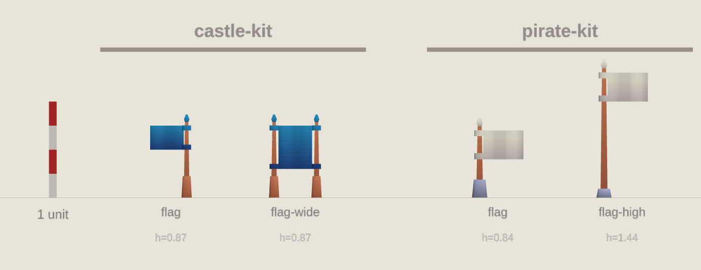

# Zelfde onderwerp naast elkaar

Per onderwerp staan de modellen uit alle kits die het hebben naast elkaar, op ware
schaal langs dezelfde meetlat van 1 unit, gegroepeerd per kit. Het onderwerp is het
laatste zelfstandige woord in de modelnaam, dus `tree-dead-large` staat bij *tree* en
`table-plate` bij *plate*.

Zie [afwijkingen.md](afwijkingen.md) voor de kits die uit de toon vallen en
[bevindingen.md](bevindingen.md) voor wat daar met het oog van te maken is.

Opnieuw maken:

```sh
node tools/vergelijk-groottes/onderwerpen.mjs
node tools/vergelijk-groottes/render.mjs \
  tools/vergelijk-groottes/onderwerpen.json docs/asset_size_review/onderwerpen onderwerp.html
node tools/vergelijk-groottes/rapport.mjs
```

83 onderwerpen, elk met hoogstens drie voorbeelden per kit.

## anvil

2 modellen uit 2 kits: rpgtools, survival-kit. Hoogtespreiding 1.89×.


## arch

6 modellen uit 3 kits: fantasy-town-kit, rocks, village-kit. Hoogtespreiding 22.10×.


## axe

2 modellen uit 2 kits: rpgtools, survival-kit. Hoogtespreiding 1.09×.


## bag

2 modellen uit 2 kits: fantasy-props, props. Hoogtespreiding 2.01×.


## balloon

4 modellen uit 2 kits: natuur, taalei-kit. Hoogtespreiding 13.53×.


## barrel

9 modellen uit 5 kits: dungeon, fantasy-props, props, tropical, village-kit. Hoogtespreiding 2.99×.


## bench

3 modellen uit 3 kits: fantasy-props, halloween, props. Hoogtespreiding 2.13×.


## blade

2 modellen uit 2 kits: fantasy-town-kit, village-kit. Hoogtespreiding 2.10×.


## block

3 modellen uit 2 kits: fantasy-town-kit, village-kit. Hoogtespreiding 1.25×.


## board

4 modellen uit 2 kits: modulair-terrein, restaurant. Hoogtespreiding 4.23×.


## book

5 modellen uit 2 kits: fantasy-props, furniture. Hoogtespreiding 2.57×.


## bottle

12 modellen uit 5 kits: dungeon, fantasy-props, pirate-kit, props, survival-kit. Hoogtespreiding 2.92×.


## box

4 modellen uit 2 kits: dungeon, props. Hoogtespreiding 1.17×.


## branch

7 modellen uit 3 kits: modulair-terrein, nature, natuur. Hoogtespreiding 1.68×.


## bucket

2 modellen uit 2 kits: fantasy-props, props. Hoogtespreiding 1.04×.


## candle

8 modellen uit 3 kits: dungeon, fantasy-props, halloween. Hoogtespreiding 2.05×.


## cart

3 modellen uit 2 kits: fantasy-town-kit, village-kit. Hoogtespreiding 1.12×.


## cattail

5 modellen uit 2 kits: modulair-terrein, natuur. Hoogtespreiding 1.20×.


## chair

2 modellen uit 2 kits: dungeon, restaurant. Hoogtespreiding 1.01×.


## chest

6 modellen uit 5 kits: dungeon, modulair-terrein, pirate-kit, survival-kit, tropical. Hoogtespreiding 1.26×.


## clump

6 modellen uit 2 kits: modulair-terrein, natuur. Hoogtespreiding 1.06×.


## coconut

2 modellen uit 2 kits: modulair-terrein, natuur. Hoogtespreiding 1.36×.


## coin

2 modellen uit 2 kits: dungeon, prototype-kit. Hoogtespreiding 6.30×.


## column

2 modellen uit 2 kits: dungeon, rocks. Hoogtespreiding 15.17×.


## crate

7 modellen uit 5 kits: fantasy-props, pirate-kit, platformer-kit, restaurant, village-kit. Hoogtespreiding 3.21×.


## daisy

4 modellen uit 2 kits: modulair-terrein, natuur. Hoogtespreiding 1.25×.


## debris

4 modellen uit 2 kits: graveyard-kit, rocks. Hoogtespreiding 4.53×.


## dirt

10 modellen uit 6 kits: dungeon, graveyard-kit, halloween, mini-forest, rocks, village-kit. Hoogtespreiding 10.02×.


## dock

5 modellen uit 2 kits: modulair-terrein, pirate-kit. Hoogtespreiding 1.05×.


## door

2 modellen uit 2 kits: fantasy-town-kit, village-kit. Hoogtespreiding 1.23×.


## doorway

9 modellen uit 4 kits: dungeon, fantasy-town-kit, survival-kit, village-kit. Hoogtespreiding 1.50×.


## edge

4 modellen uit 2 kits: fantasy-town-kit, village-kit. Hoogtespreiding 1.75×.


## fence

13 modellen uit 5 kits: fantasy-town-kit, modulair-terrein, pirate-kit, platformer-kit, survival-kit. Hoogtespreiding 2.48×.


## flag

4 modellen uit 2 kits: castle-kit, pirate-kit. Hoogtespreiding 1.32×.



## floor

9 modellen uit 3 kits: dungeon, survival-kit, village-kit. Hoogtespreiding 1.77×.


## flower

5 modellen uit 2 kits: platformer-kit, quaternius-nature. Hoogtespreiding 5.57×.


## gate

3 modellen uit 2 kits: fantasy-town-kit, modulair-terrein. Hoogtespreiding 1.18×.


## glass

2 modellen uit 2 kits: fantasy-town-kit, rpgtools. Hoogtespreiding 2.63×.


## grass

10 modellen uit 6 kits: forest, mini-forest, pirate-kit, quaternius-nature, survival-kit, village-kit. Hoogtespreiding 10.13×.


## hammer

2 modellen uit 2 kits: rpgtools, survival-kit. Hoogtespreiding 1.19×.


## hole

3 modellen uit 3 kits: modular-cave-kit, pirate-kit, survival-kit. Hoogtespreiding 6.43×.


## key

3 modellen uit 2 kits: dungeon, fantasy-props. Hoogtespreiding 11.75×.


## knife

2 modellen uit 2 kits: restaurant, rpgtools. Hoogtespreiding 1.29×.


## ladder

6 modellen uit 4 kits: mini-forest, modular-cave-kit, platformer-kit, village-kit. Hoogtespreiding 3.25×.


## lantern

5 modellen uit 3 kits: halloween, holiday-kit, rpgtools. Hoogtespreiding 2.71×.


## lever

3 modellen uit 2 kits: platformer-kit, prototype-kit. Hoogtespreiding 1.56×.


## log

9 modellen uit 5 kits: castle-kit, natuur, quaternius-nature, resources, survival-kit. Hoogtespreiding 2.79×.


## mountain

7 modellen uit 3 kits: modulair-terrein, nature, natuur. Hoogtespreiding 5.63×.


## mushroom

7 modellen uit 4 kits: modulair-terrein, natuur, platformer-kit, props. Hoogtespreiding 3.57×.


## overhang

2 modellen uit 2 kits: fantasy-town-kit, platformer-kit. Hoogtespreiding 1.31×.


## palm

7 modellen uit 3 kits: modulair-terrein, natuur, tropical. Hoogtespreiding 1.82×.


## pickaxe

2 modellen uit 2 kits: rpgtools, survival-kit. Hoogtespreiding 1.28×.


## pile

5 modellen uit 3 kits: holiday-kit, modulair-terrein, resources. Hoogtespreiding 1.81×.


## pillar

6 modellen uit 3 kits: dungeon, fantasy-town-kit, village-kit. Hoogtespreiding 2.33×.


## pine

13 modellen uit 5 kits: graveyard-kit, halloween, modulair-terrein, natuur, quaternius-nature. Hoogtespreiding 2.09×.


## plank

7 modellen uit 4 kits: fantasy-town-kit, pirate-kit, resources, survival-kit. Hoogtespreiding 2.85×.


## plant

4 modellen uit 2 kits: quaternius-nature, tropical. Hoogtespreiding 3.84×.


## plate

7 modellen uit 4 kits: dungeon, fantasy-props, props, restaurant. Hoogtespreiding 2.87×.


## platform

5 modellen uit 2 kits: pirate-kit, platformer-kit. Hoogtespreiding 1.80×.


## pole

2 modellen uit 2 kits: fantasy-town-kit, platformer-kit. Hoogtespreiding 1.00×.


## post

7 modellen uit 4 kits: halloween, modulair-terrein, natuur, village-kit. Hoogtespreiding 4.37×.


## pot

4 modellen uit 2 kits: mini-dungeon, restaurant. Hoogtespreiding 2.46×.


## ramp

4 modellen uit 2 kits: platformer-kit, village-kit. Hoogtespreiding 1.28×.


## rock

30 modellen uit 12 kits: castle-kit, dungeon, fantasy-town-kit, forest, graveyard-kit, holiday-kit, modulair-terrein, natuur, pirate-kit, platformer-kit, quaternius-nature, survival-kit. Hoogtespreiding 5.20×.


## roof

8 modellen uit 4 kits: fantasy-town-kit, pirate-kit, survival-kit, village-kit. Hoogtespreiding 1.89×.


## rope

5 modellen uit 4 kits: modulair-terrein, pirate-kit, platformer-kit, village-kit. Hoogtespreiding 10.52×.


## rubble

3 modellen uit 2 kits: dungeon, fantasy-props. Hoogtespreiding 7.00×.


## sand

6 modellen uit 2 kits: pirate-kit, survival-kit. Hoogtespreiding 1.59×.


## shelf

6 modellen uit 3 kits: dungeon, fantasy-props, furniture. Hoogtespreiding 2.21×.


## shovel

3 modellen uit 3 kits: graveyard-kit, rpgtools, survival-kit. Hoogtespreiding 1.21×.


## sign

2 modellen uit 2 kits: platformer-kit, village-kit. Hoogtespreiding 1.04×.


## stack

10 modellen uit 4 kits: dungeon, fantasy-props, natuur, resources. Hoogtespreiding 3.64×.


## stair

9 modellen uit 4 kits: dungeon, fantasy-town-kit, props, village-kit. Hoogtespreiding 1.79×.


## star

2 modellen uit 2 kits: natuur, platformer-kit. Hoogtespreiding 3.70×.


## step

2 modellen uit 2 kits: modulair-terrein, village-kit. Hoogtespreiding 1.25×.


## stool

2 modellen uit 2 kits: dungeon, props. Hoogtespreiding 1.48×.


## stump

5 modellen uit 3 kits: modulair-terrein, natuur, quaternius-nature. Hoogtespreiding 3.09×.


## sunflower

4 modellen uit 2 kits: modulair-terrein, natuur. Hoogtespreiding 1.19×.


## table

8 modellen uit 4 kits: dungeon, furniture, props, restaurant. Hoogtespreiding 1.37×.


## torch

3 modellen uit 3 kits: dungeon, fantasy-props, rpgtools. Hoogtespreiding 1.78×.


## tree

22 modellen uit 9 kits: castle-kit, fantasy-town-kit, forest, halloween, holiday-kit, mini-forest, nature, natuur, survival-kit. Hoogtespreiding 1.76×.


## wall

12 modellen uit 4 kits: dungeon, fantasy-town-kit, rocks, village-kit. Hoogtespreiding 12.79×.


## window

7 modellen uit 3 kits: dungeon, fantasy-town-kit, village-kit. Hoogtespreiding 2.33×.


