# Zelfde onderwerp naast elkaar

Per onderwerp staan de modellen uit alle kits die het hebben naast elkaar, op ware
schaal langs dezelfde meetlat van 1 unit, gegroepeerd per kit. Het onderwerp is het
laatste zelfstandige woord in de modelnaam, dus `tree-dead-large` staat bij *tree* en
`table-plate` bij *plate*.

Zie [afwijkingen.md](afwijkingen.md) voor de kits die uit de toon vallen en
[bevindingen.md](bevindingen.md) voor wat daar met het oog van te maken is.

Opnieuw maken:

```sh
node tools/vergelijk-groottes/onderwerpen.mjs
node tools/vergelijk-groottes/render.mjs \
  tools/vergelijk-groottes/onderwerpen.json docs/asset_size_review/onderwerpen onderwerp.html
node tools/vergelijk-groottes/rapport.mjs
```

77 onderwerpen, elk met hoogstens drie voorbeelden per kit.

## anvil

2 modellen uit 2 kits: rpgtools, survival-kit. Hoogtespreiding 1.95×.


## arch

6 modellen uit 3 kits: fantasy-town-kit, rocks, village-kit. Hoogtespreiding 22.10×.


## axe

2 modellen uit 2 kits: rpgtools, survival-kit. Hoogtespreiding 1.13×.

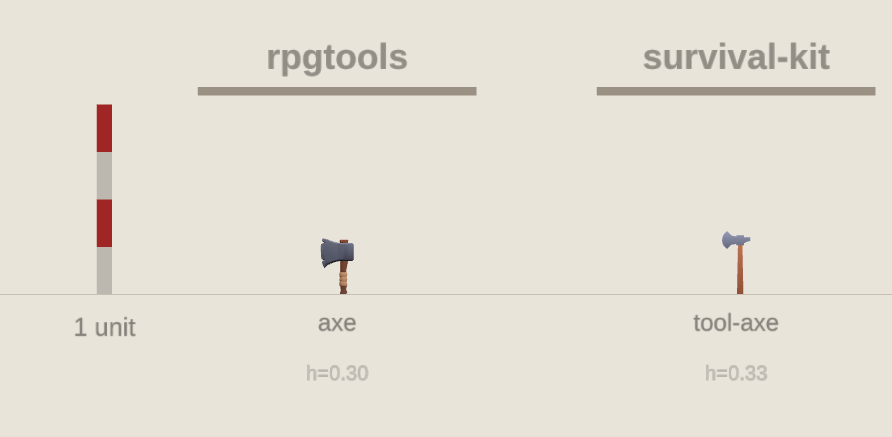

## bag

2 modellen uit 2 kits: fantasy-props, props. Hoogtespreiding 1.01×.

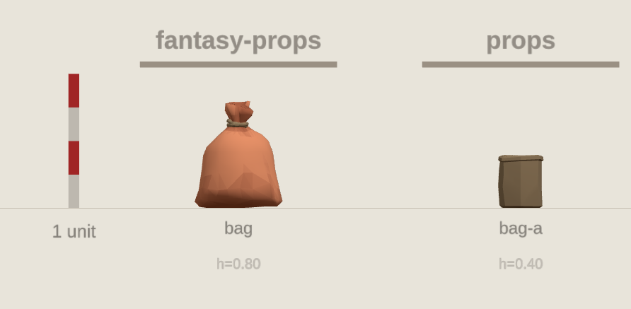

## balloon

4 modellen uit 2 kits: natuur, taalei-kit. Hoogtespreiding 22.53×.


## barrel

8 modellen uit 4 kits: dungeon, fantasy-props, props, village-kit. Hoogtespreiding 1.99×.


## bench

3 modellen uit 3 kits: fantasy-props, halloween, props. Hoogtespreiding 1.92×.


## blade

2 modellen uit 2 kits: fantasy-town-kit, village-kit. Hoogtespreiding 3.23×.


## block

3 modellen uit 2 kits: fantasy-town-kit, village-kit. Hoogtespreiding 1.23×.

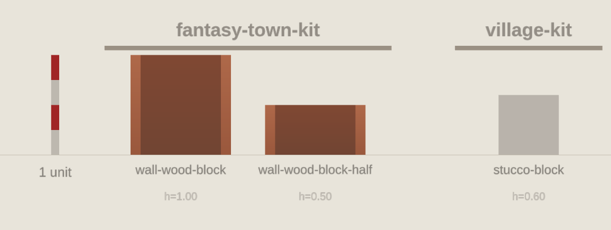

## board

4 modellen uit 2 kits: modulair-terrein, restaurant. Hoogtespreiding 4.24×.


## bottle

12 modellen uit 5 kits: dungeon, fantasy-props, pirate-kit, props, survival-kit. Hoogtespreiding 1.81×.


## box

4 modellen uit 2 kits: dungeon, props. Hoogtespreiding 1.20×.

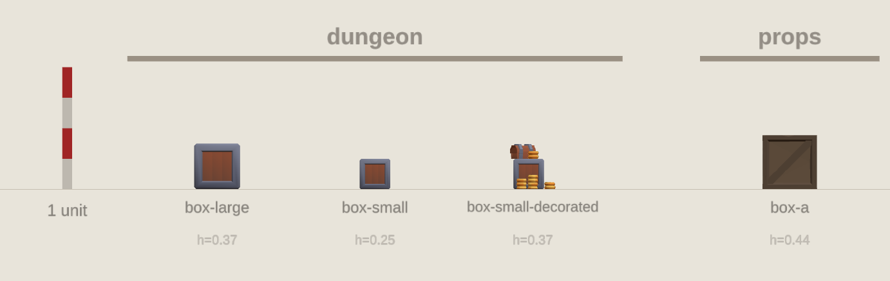

## branch

6 modellen uit 2 kits: modulair-terrein, natuur. Hoogtespreiding 1.44×.

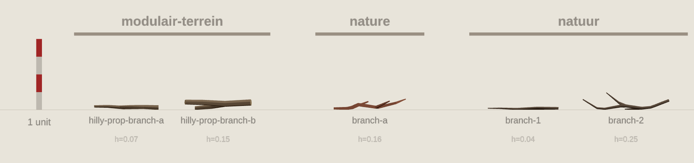

## bucket

2 modellen uit 2 kits: fantasy-props, props. Hoogtespreiding 1.92×.


## candle

6 modellen uit 2 kits: dungeon, halloween. Hoogtespreiding 1.00×.


## cart

3 modellen uit 2 kits: fantasy-town-kit, village-kit. Hoogtespreiding 1.72×.

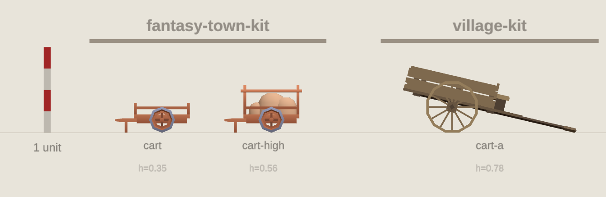

## cattail

5 modellen uit 2 kits: modulair-terrein, natuur. Hoogtespreiding 1.40×.

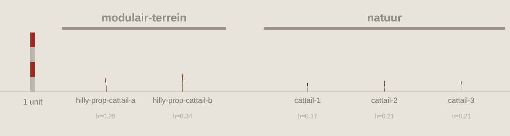

## chair

2 modellen uit 2 kits: dungeon, restaurant. Hoogtespreiding 1.04×.

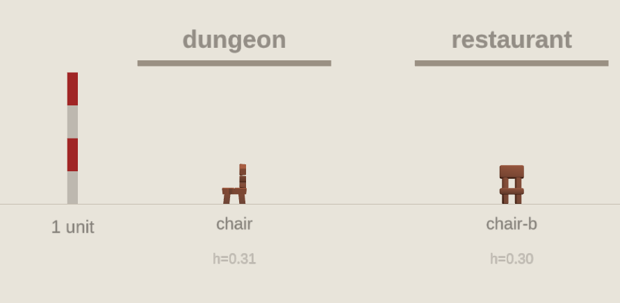

## chest

4 modellen uit 3 kits: dungeon, pirate-kit, survival-kit. Hoogtespreiding 1.15×.

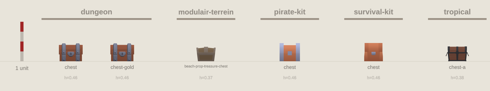

## clump

6 modellen uit 2 kits: modulair-terrein, natuur. Hoogtespreiding 1.23×.

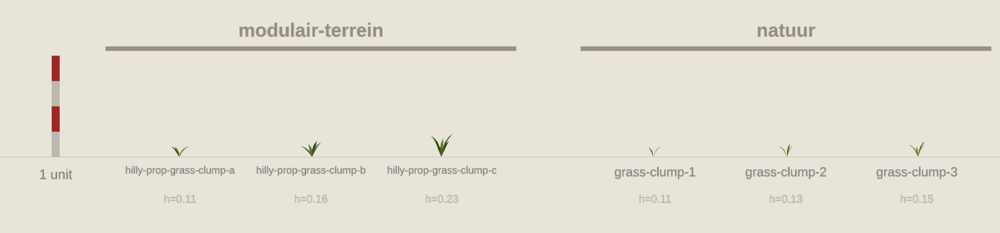

## coconut

2 modellen uit 2 kits: modulair-terrein, natuur. Hoogtespreiding 1.56×.

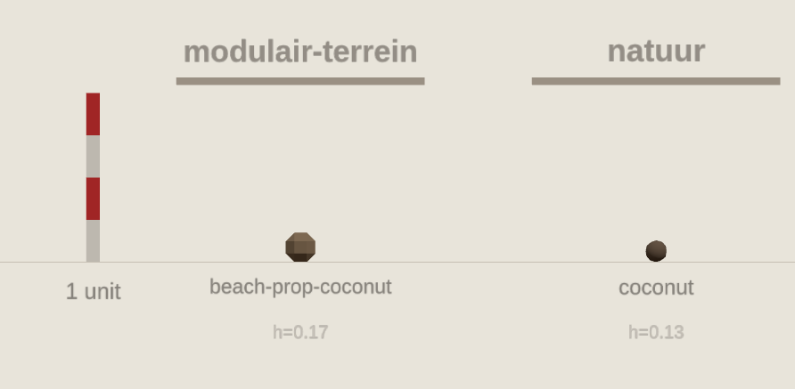

## coin

2 modellen uit 2 kits: dungeon, prototype-kit. Hoogtespreiding 5.81×.


## column

2 modellen uit 2 kits: dungeon, rocks. Hoogtespreiding 21.24×.


## crate

5 modellen uit 4 kits: pirate-kit, platformer-kit, restaurant, village-kit. Hoogtespreiding 3.06×.


## daisy

4 modellen uit 2 kits: modulair-terrein, natuur. Hoogtespreiding 1.45×.

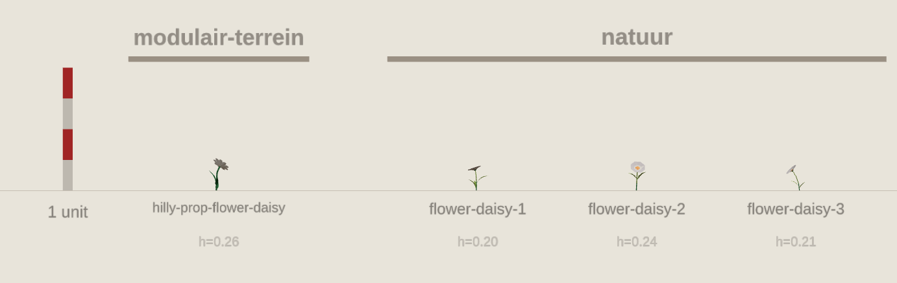

## dirt

9 modellen uit 5 kits: dungeon, halloween, mini-forest, rocks, village-kit. Hoogtespreiding 3.13×.


## dock

5 modellen uit 2 kits: modulair-terrein, pirate-kit. Hoogtespreiding 1.05×.

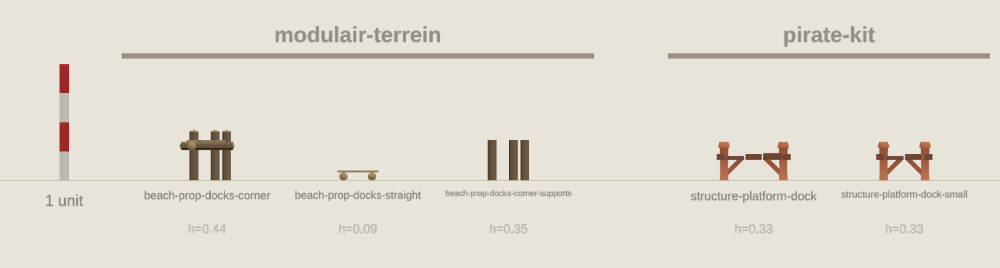

## door

2 modellen uit 2 kits: fantasy-town-kit, village-kit. Hoogtespreiding 1.25×.

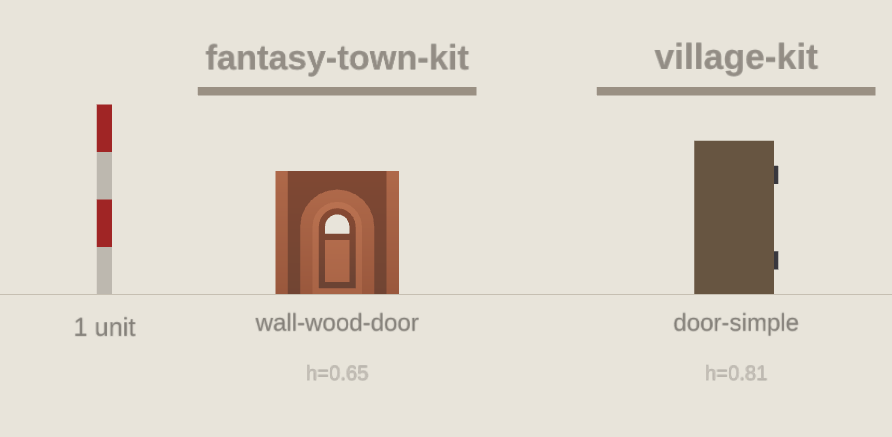

## doorway

9 modellen uit 4 kits: dungeon, fantasy-town-kit, survival-kit, village-kit. Hoogtespreiding 1.85×.


## edge

4 modellen uit 2 kits: fantasy-town-kit, village-kit. Hoogtespreiding 1.14×.

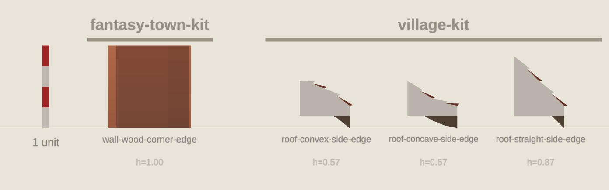

## fence

13 modellen uit 5 kits: fantasy-town-kit, modulair-terrein, pirate-kit, platformer-kit, survival-kit. Hoogtespreiding 2.72×.


## floor

9 modellen uit 3 kits: dungeon, survival-kit, village-kit. Hoogtespreiding 1.81×.


## flower

5 modellen uit 2 kits: platformer-kit, quaternius-nature. Hoogtespreiding 3.43×.


## gate

3 modellen uit 2 kits: fantasy-town-kit, modulair-terrein. Hoogtespreiding 1.28×.

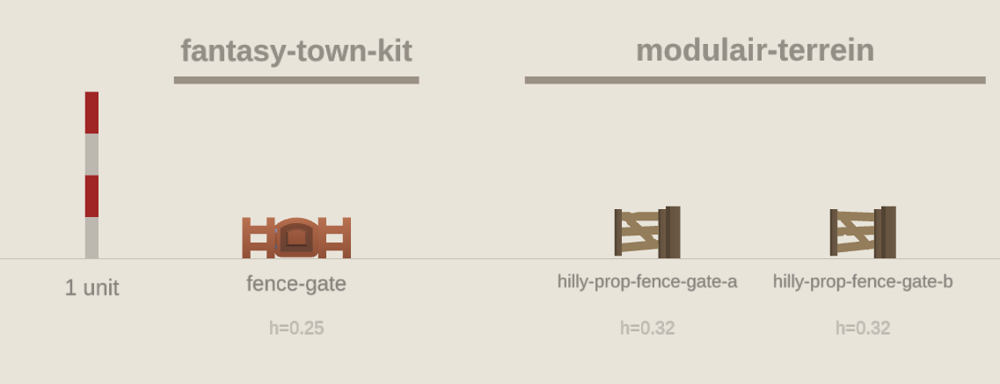

## glass

2 modellen uit 2 kits: fantasy-town-kit, rpgtools. Hoogtespreiding 2.44×.


## grass

7 modellen uit 5 kits: forest, mini-forest, pirate-kit, survival-kit, village-kit. Hoogtespreiding 4.67×.


## hammer

2 modellen uit 2 kits: rpgtools, survival-kit. Hoogtespreiding 1.15×.

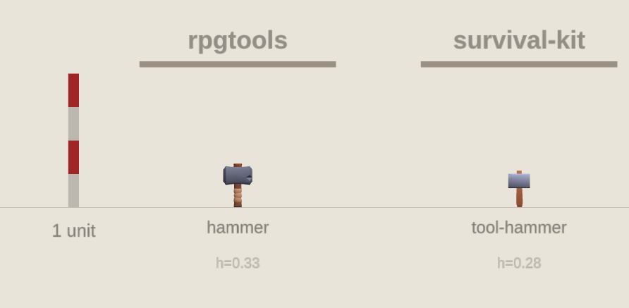

## hole

3 modellen uit 3 kits: modular-cave-kit, pirate-kit, survival-kit. Hoogtespreiding 5.77×.


## key

3 modellen uit 2 kits: dungeon, fantasy-props. Hoogtespreiding 16.83×.


## knife

2 modellen uit 2 kits: restaurant, rpgtools. Hoogtespreiding 1.28×.

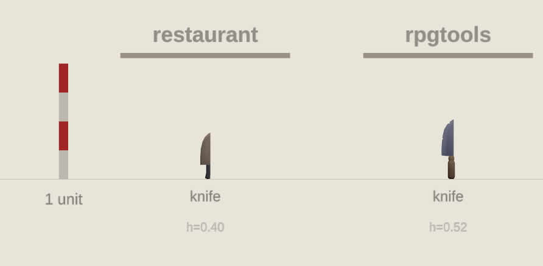

## ladder

6 modellen uit 4 kits: mini-forest, modular-cave-kit, platformer-kit, village-kit. Hoogtespreiding 5.00×.


## lantern

3 modellen uit 2 kits: halloween, rpgtools. Hoogtespreiding 2.11×.


## lever

3 modellen uit 2 kits: platformer-kit, prototype-kit. Hoogtespreiding 1.56×.

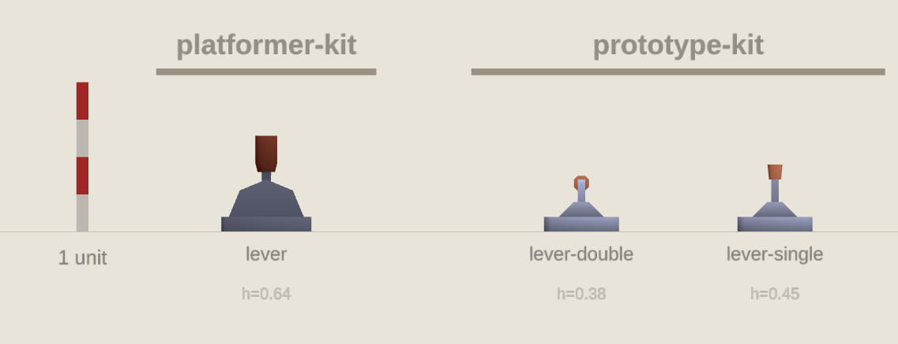

## log

8 modellen uit 4 kits: natuur, quaternius-nature, resources, survival-kit. Hoogtespreiding 2.24×.


## mountain

6 modellen uit 2 kits: modulair-terrein, natuur. Hoogtespreiding 4.83×.


## mushroom

7 modellen uit 4 kits: modulair-terrein, natuur, platformer-kit, props. Hoogtespreiding 3.84×.


## overhang

2 modellen uit 2 kits: fantasy-town-kit, platformer-kit. Hoogtespreiding 1.31×.

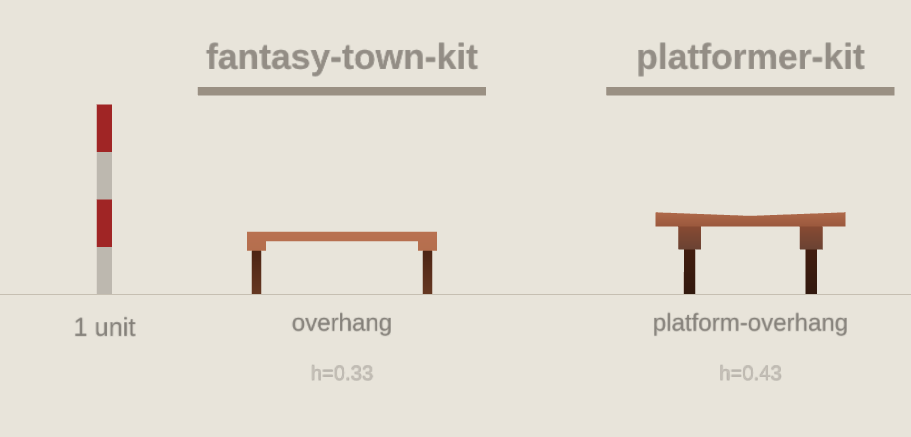

## palm

6 modellen uit 2 kits: modulair-terrein, natuur. Hoogtespreiding 1.43×.

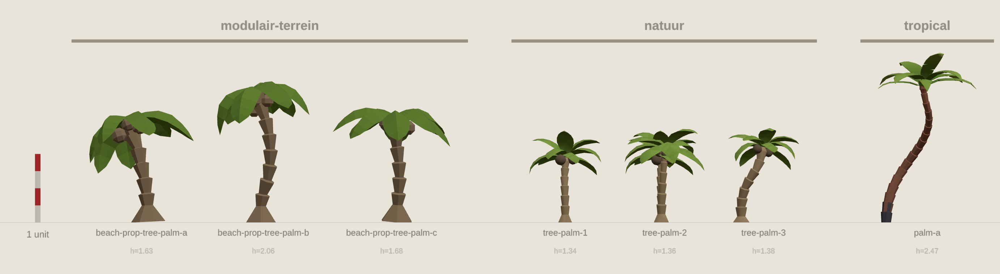

## pickaxe

2 modellen uit 2 kits: rpgtools, survival-kit. Hoogtespreiding 1.24×.

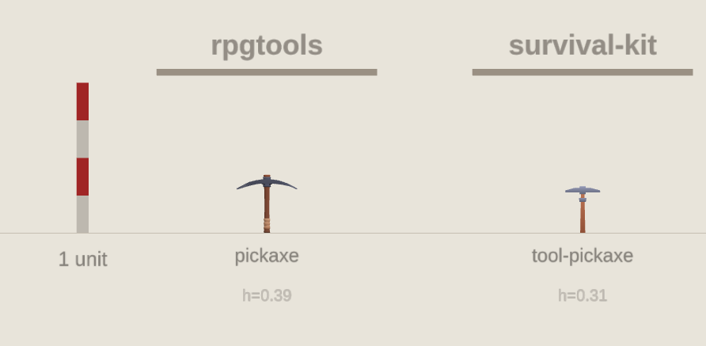

## pile

4 modellen uit 2 kits: modulair-terrein, resources. Hoogtespreiding 2.18×.


## pillar

6 modellen uit 3 kits: dungeon, fantasy-town-kit, village-kit. Hoogtespreiding 1.67×.

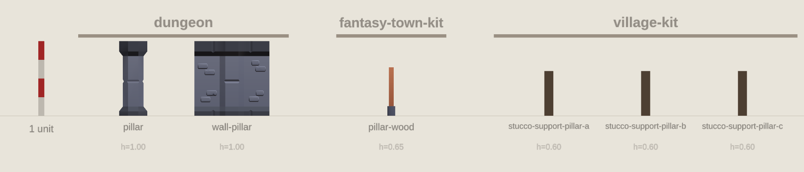

## pine

11 modellen uit 4 kits: halloween, modulair-terrein, natuur, quaternius-nature. Hoogtespreiding 1.73×.

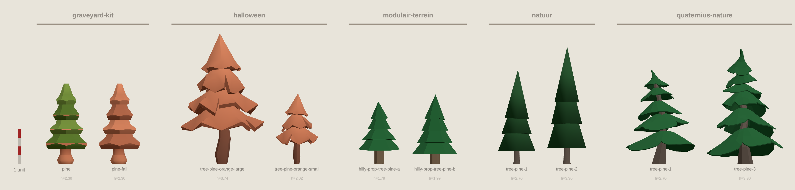

## plank

7 modellen uit 4 kits: fantasy-town-kit, pirate-kit, resources, survival-kit. Hoogtespreiding 3.13×.


## plate

7 modellen uit 4 kits: dungeon, fantasy-props, props, restaurant. Hoogtespreiding 5.75×.


## platform

5 modellen uit 2 kits: pirate-kit, platformer-kit. Hoogtespreiding 1.76×.

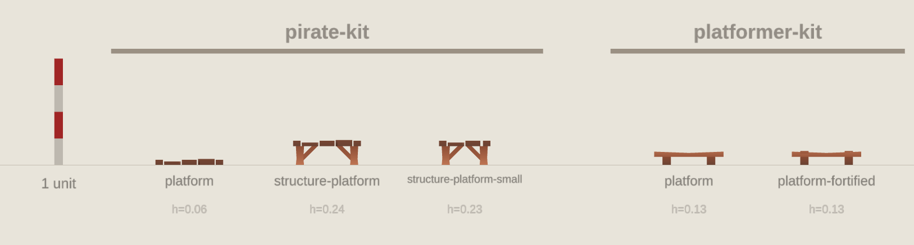

## pole

2 modellen uit 2 kits: fantasy-town-kit, platformer-kit. Hoogtespreiding 1.00×.

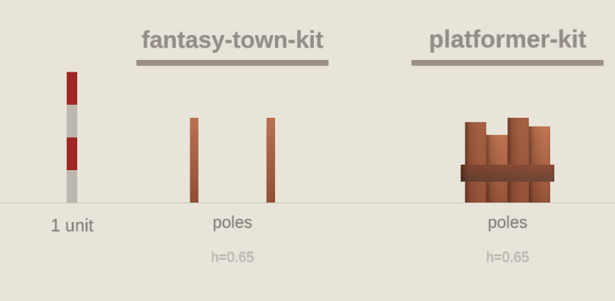

## post

7 modellen uit 4 kits: halloween, modulair-terrein, natuur, village-kit. Hoogtespreiding 3.45×.


## ramp

4 modellen uit 2 kits: platformer-kit, village-kit. Hoogtespreiding 1.96×.


## rock

23 modellen uit 9 kits: dungeon, fantasy-town-kit, forest, modulair-terrein, natuur, pirate-kit, platformer-kit, quaternius-nature, survival-kit. Hoogtespreiding 4.63×.


## roof

8 modellen uit 4 kits: fantasy-town-kit, pirate-kit, survival-kit, village-kit. Hoogtespreiding 1.84×.


## rope

4 modellen uit 3 kits: pirate-kit, platformer-kit, village-kit. Hoogtespreiding 10.27×.


## sand

6 modellen uit 2 kits: pirate-kit, survival-kit. Hoogtespreiding 1.40×.

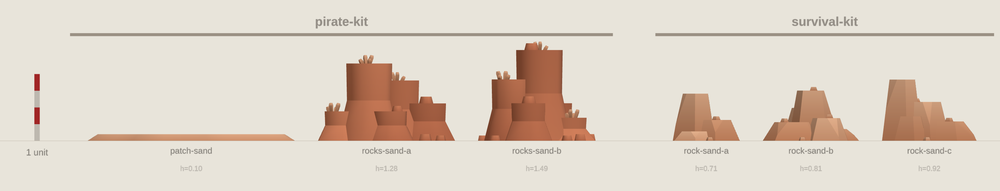

## shelf

3 modellen uit 2 kits: dungeon, fantasy-props. Hoogtespreiding 1.45×.

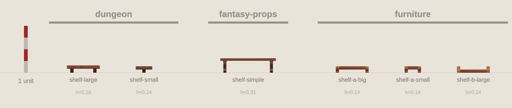

## shovel

2 modellen uit 2 kits: rpgtools, survival-kit. Hoogtespreiding 1.17×.

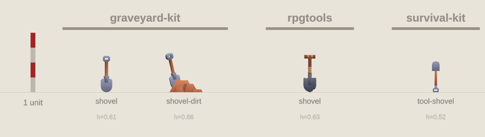

## sign

2 modellen uit 2 kits: platformer-kit, village-kit. Hoogtespreiding 1.47×.

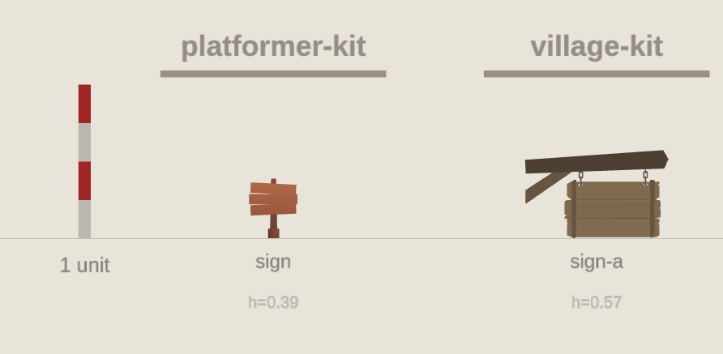

## stack

10 modellen uit 4 kits: dungeon, fantasy-props, natuur, resources. Hoogtespreiding 7.27×.


## stair

9 modellen uit 4 kits: dungeon, fantasy-town-kit, props, village-kit. Hoogtespreiding 1.96×.


## star

2 modellen uit 2 kits: natuur, platformer-kit. Hoogtespreiding 4.00×.


## step

2 modellen uit 2 kits: modulair-terrein, village-kit. Hoogtespreiding 1.79×.

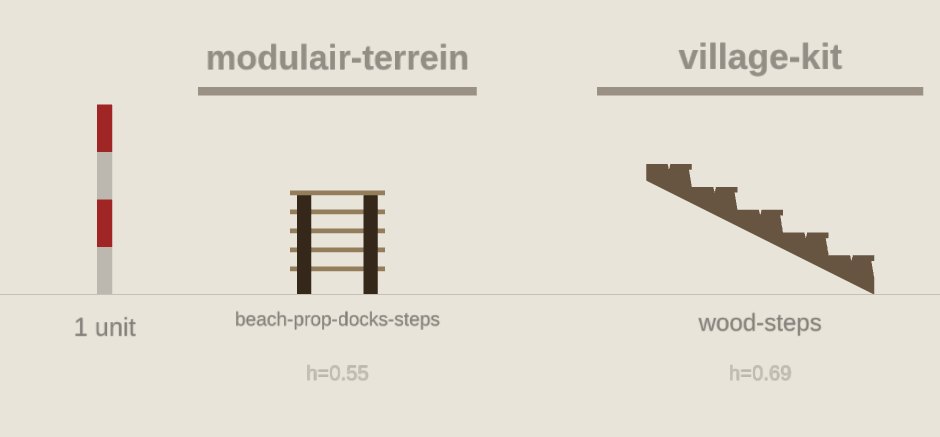

## stool

2 modellen uit 2 kits: dungeon, props. Hoogtespreiding 2.07×.


## stump

4 modellen uit 2 kits: modulair-terrein, natuur. Hoogtespreiding 1.73×.


## sunflower

4 modellen uit 2 kits: modulair-terrein, natuur. Hoogtespreiding 1.02×.

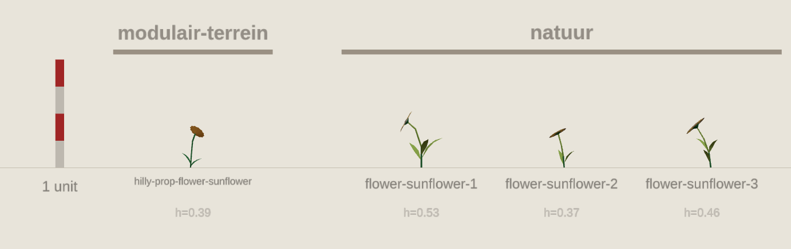

## table

5 modellen uit 3 kits: dungeon, props, restaurant. Hoogtespreiding 1.96×.


## torch

3 modellen uit 3 kits: dungeon, fantasy-props, rpgtools. Hoogtespreiding 1.26×.

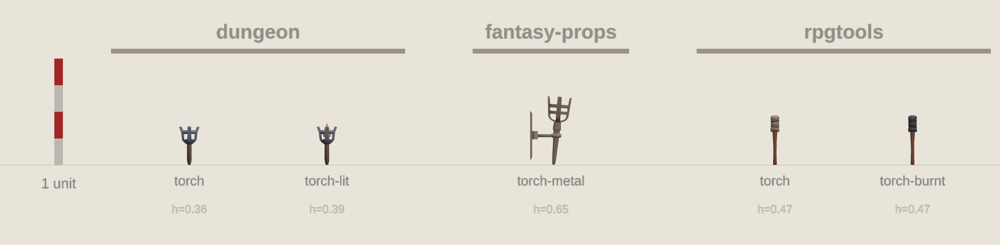

## tree

16 modellen uit 6 kits: fantasy-town-kit, forest, halloween, mini-forest, natuur, survival-kit. Hoogtespreiding 2.08×.


## wall

12 modellen uit 4 kits: dungeon, fantasy-town-kit, rocks, village-kit. Hoogtespreiding 12.79×.


## window

7 modellen uit 3 kits: dungeon, fantasy-town-kit, village-kit. Hoogtespreiding 1.87×.


