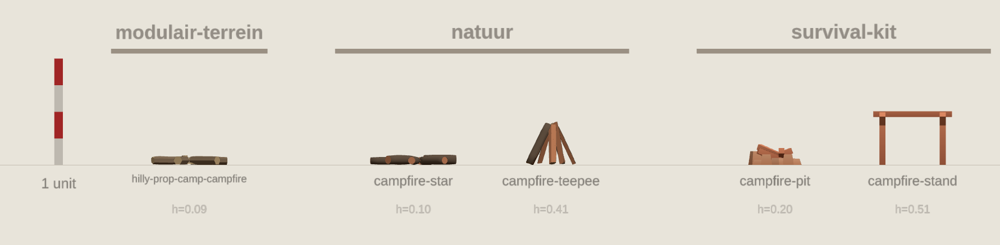

# Zelfde onderwerp naast elkaar

Per onderwerp staan de modellen uit alle kits die het hebben naast elkaar, op ware
schaal langs dezelfde meetlat van 1 unit. Zo zie je in een oogopslag welke kit een
boom, rots of kist groter, kleiner of anders van stijl maakt dan de rest.

Opnieuw maken:

```sh
node tools/vergelijk-groottes/onderwerpen.mjs
node tools/vergelijk-groottes/render.mjs \
  tools/vergelijk-groottes/onderwerpen.json docs/asset_size_review/onderwerpen onderwerp.html
```

42 onderwerpen, elk met hoogstens twee voorbeelden per kit.

## arch

5 modellen uit 3 kits: fantasy-town-kit, rocks, village-kit


## barrel

8 modellen uit 5 kits: dungeon, fantasy-props, props, tropical, village-kit


## bench

3 modellen uit 3 kits: fantasy-props, halloween, props


## bottle

9 modellen uit 5 kits: dungeon, fantasy-props, pirate-kit, props, survival-kit


## branch

5 modellen uit 3 kits: modulair-terrein, nature, natuur


## campfire

5 modellen uit 3 kits: modulair-terrein, natuur, survival-kit



## candle

6 modellen uit 3 kits: dungeon, fantasy-props, halloween


## chest

6 modellen uit 5 kits: dungeon, modulair-terrein, pirate-kit, survival-kit, tropical


## crate

11 modellen uit 6 kits: dungeon, fantasy-props, pirate-kit, platformer-kit, restaurant, village-kit


## dirt

9 modellen uit 6 kits: dungeon, graveyard-kit, halloween, mini-forest, rocks, village-kit


## doorway

7 modellen uit 4 kits: dungeon, fantasy-town-kit, survival-kit, village-kit


## fence

10 modellen uit 5 kits: fantasy-town-kit, modulair-terrein, pirate-kit, platformer-kit, survival-kit


## floor

9 modellen uit 5 kits: dungeon, halloween, modular-cave-kit, survival-kit, village-kit


## flower

8 modellen uit 4 kits: modulair-terrein, natuur, platformer-kit, quaternius-nature


## grass

13 modellen uit 8 kits: forest, mini-forest, modulair-terrein, natuur, pirate-kit, quaternius-nature, survival-kit, village-kit


## hole

3 modellen uit 3 kits: modular-cave-kit, pirate-kit, survival-kit


## ladder

5 modellen uit 4 kits: mini-forest, modular-cave-kit, platformer-kit, village-kit


## lantern

5 modellen uit 3 kits: halloween, holiday-kit, rpgtools


## log

9 modellen uit 5 kits: castle-kit, natuur, quaternius-nature, resources, survival-kit


## mountain

5 modellen uit 3 kits: modulair-terrein, nature, natuur


## mushroom

6 modellen uit 4 kits: modulair-terrein, natuur, platformer-kit, props


## palm

7 modellen uit 4 kits: modulair-terrein, natuur, pirate-kit, tropical


## pickaxe

3 modellen uit 3 kits: fantasy-props, rpgtools, survival-kit


## pile

4 modellen uit 3 kits: holiday-kit, modulair-terrein, resources


## pillar

5 modellen uit 3 kits: dungeon, fantasy-town-kit, village-kit


## pine

10 modellen uit 5 kits: graveyard-kit, halloween, modulair-terrein, natuur, quaternius-nature


## plank

6 modellen uit 4 kits: fantasy-town-kit, pirate-kit, resources, survival-kit


## plate

7 modellen uit 4 kits: dungeon, fantasy-props, props, restaurant


## post

7 modellen uit 4 kits: halloween, modulair-terrein, natuur, village-kit


## rock

20 modellen uit 10 kits: castle-kit, fantasy-town-kit, forest, holiday-kit, modulair-terrein, natuur, pirate-kit, quaternius-nature, rocks, survival-kit


## roof

6 modellen uit 4 kits: fantasy-town-kit, pirate-kit, survival-kit, village-kit


## rope

7 modellen uit 5 kits: modulair-terrein, pirate-kit, platformer-kit, rpgtools, village-kit


## shelf

5 modellen uit 3 kits: dungeon, fantasy-props, furniture


## shovel

4 modellen uit 3 kits: graveyard-kit, rpgtools, survival-kit


## stack

8 modellen uit 4 kits: dungeon, fantasy-props, natuur, resources


## stair

7 modellen uit 4 kits: dungeon, fantasy-town-kit, props, village-kit


## stump

5 modellen uit 3 kits: modulair-terrein, natuur, quaternius-nature


## table

7 modellen uit 5 kits: dungeon, fantasy-props, furniture, props, restaurant


## torch

5 modellen uit 3 kits: dungeon, fantasy-props, rpgtools


## tree

20 modellen uit 10 kits: castle-kit, fantasy-town-kit, forest, halloween, holiday-kit, mini-forest, modulair-terrein, natuur, quaternius-nature, survival-kit


## wall

8 modellen uit 4 kits: dungeon, fantasy-town-kit, rocks, village-kit


## window

6 modellen uit 3 kits: dungeon, fantasy-town-kit, village-kit


