# Inconsistenties tussen kits

Afgeleid uit `onderwerpen.json` en `catalog/catalog.json`, over dezelfde modellen
als in de renders. Per onderwerp is de mediane hoogte per kit vergeleken met de
mediaan over alle kits; een factor van 1.00 is dus "net als de rest".

```sh
node tools/vergelijk-groottes/afwijkingen.mjs
```

Onderwerpen met meer dan één kit: 77. Daarvan met een spreiding van
1.8× of meer tussen grootste en kleinste kit: 44.

## Kits die er structureel uit springen

`factor` is het meetkundig gemiddelde over alle onderwerpen van die kit.

| kit | factor | te groot bij | te klein bij | veel dichter mesh bij |
| --- | ---: | --- | --- | --- |
| pirate-kit | 1.21 | fence, rock, rope | grass | fence, roof |
| dungeon | 0.84 | key | coin, column, dirt | chest, doorway, pillar, rock, wall, window |
| natuur | 0.77 | – | balloon, log, mushroom, star | post |
| rocks | 3.99 | arch, column, wall | – | dirt |
| survival-kit | 1.18 | fence, grass, rock | – | – |
| platformer-kit | 0.92 | mushroom | flower, rope | – |
| fantasy-town-kit | 0.88 | rock | blade, plank | stair |
| fantasy-props | 0.69 | – | candle, key, plate | candle, crate |
| props | 1.19 | plate, table | – | – |
| village-kit | 1.09 | crate, ladder | – | crate |
| modulair-terrein | 0.90 | – | mountain, post | – |
| modular-cave-kit | 2.01 | hole | – | – |
| taalei-kit | 1.92 | balloon | – | – |
| resources | 1.51 | stack | – | stack |
| quaternius-nature | 1.24 | grass | – | pine |
| halloween | 1.07 | – | bench | – |
| restaurant | 0.74 | – | board | – |
| prototype-kit | 1.16 | – | – | – |
| rpgtools | 0.89 | – | – | – |
| mini-forest | 0.81 | – | – | – |
| forest | 0.78 | – | – | – |

## Per onderwerp

### balloon — spreiding 22.53×

Mediaan over de kits: 2.60 unit hoog. 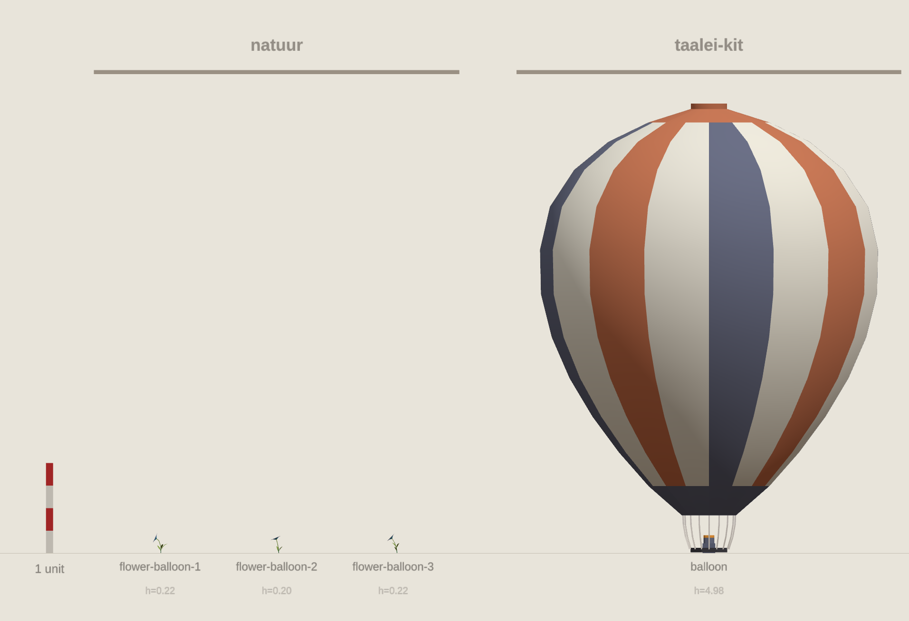

| kit | hoogte | factor | grondvlak | driehoeken/unit | kleuren | modellen |
| --- | ---: | ---: | ---: | ---: | --- | --- |
| taalei-kit | 4.98 | 1.92 ⬆ | 3.74 | 13 | #3e3e44 #6d738a #d07b56 | balloon |
| natuur | 0.22 | 0.08 ⬇ | 0.14 | 79 | #23562c #2473b3 #6d8d33 | flower-balloon-1, flower-balloon-2, flower-balloon-3 |

### arch — spreiding 22.10×

Mediaan over de kits: 0.65 unit hoog. 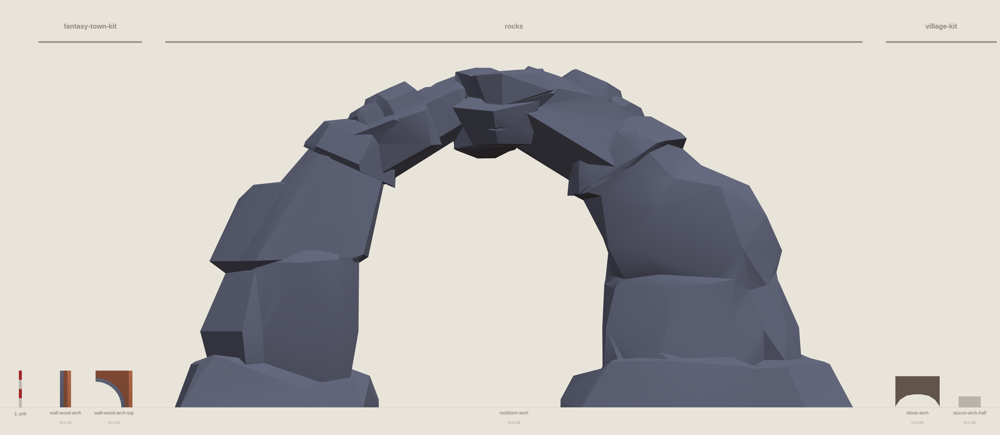

| kit | hoogte | factor | grondvlak | driehoeken/unit | kleuren | modellen |
| --- | ---: | ---: | ---: | ---: | --- | --- |
| rocks | 9.28 | 14.28 ⬆ | 18.39 | 2 | #6d738a | rockform-arch |
| fantasy-town-kit | 0.65 | 1.00 | 0.42 | 89 | #6d738a #995a41 #d07b56 | wall-wood-arch, wall-wood-arch-top |
| village-kit | 0.42 | 0.65 | 0.66 | 44 | #f4efe3 #88796d #8f785b | stone-arch, stucco-arch-half, stucco-arch-half-outer |

### column — spreiding 21.24×

Mediaan over de kits: 3.89 unit hoog. 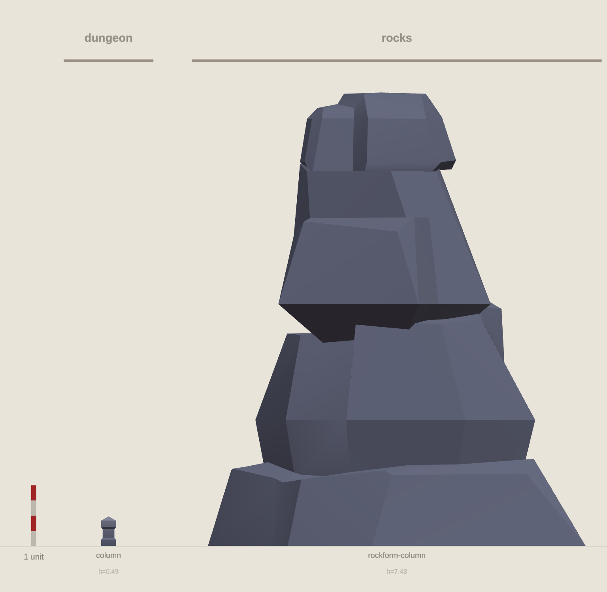

| kit | hoogte | factor | grondvlak | driehoeken/unit | kleuren | modellen |
| --- | ---: | ---: | ---: | ---: | --- | --- |
| rocks | 7.43 | 1.91 ⬆ | 6.18 | 1 | #6d738a | rockform-column |
| dungeon | 0.35 | 0.09 ⬇ | 0.17 | 44 | #6d738a | column |

### key — spreiding 16.83×

Mediaan over de kits: 0.05 unit hoog. 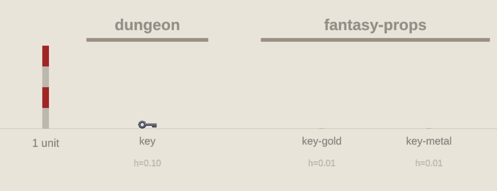

| kit | hoogte | factor | grondvlak | driehoeken/unit | kleuren | modellen |
| --- | ---: | ---: | ---: | ---: | --- | --- |
| dungeon | 0.10 | 1.89 ⬆ | 0.22 | 160 | #6d738a | key |
| fantasy-props | 0.01 | 0.11 ⬇ | 0.06 | 956 | #ffb349 #88796d | key-gold, key-metal |

### wall — spreiding 12.79×

Mediaan over de kits: 0.82 unit hoog. 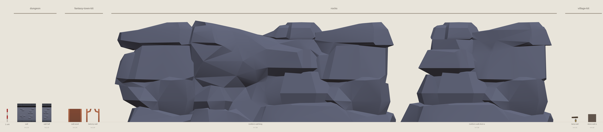

| kit | hoogte | factor | grondvlak | driehoeken/unit | kleuren | modellen |
| --- | ---: | ---: | ---: | ---: | --- | --- |
| rocks | 7.67 | 9.30 ⬆ | 11.49 | 1 | #6d738a | rockform-wall-long, rockform-wall-short-a, rockform-wall-short-b |
| dungeon | 1.00 | 1.21 | 1.00 | 494 | #474a58 #6d738a | wall, wall-half, wall-broken |
| fantasy-town-kit | 0.65 | 0.79 | 0.65 | 32 | #d07b56 #995a41 | wall-wood, balcony-wall, wall-wood-half |
| village-kit | 0.60 | 0.73 | 0.60 | 122 | #88796d #3e3e44 #8f785b | lamp-wall, stone-wall-a, stone-wall-b |

### rope — spreiding 10.27×

Mediaan over de kits: 0.49 unit hoog. 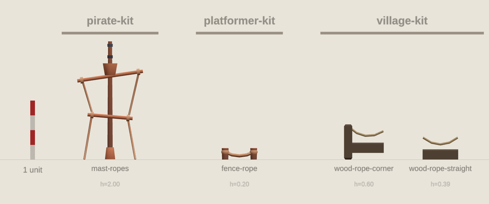

| kit | hoogte | factor | grondvlak | driehoeken/unit | kleuren | modellen |
| --- | ---: | ---: | ---: | ---: | --- | --- |
| pirate-kit | 2.00 | 4.05 ⬆ | 1.11 | 175 | #474a58 #995a41 #d07b56 | mast-ropes |
| village-kit | 0.49 | 1.00 | 0.63 | 124 | #8f785b | wood-rope-corner, wood-rope-straight |
| platformer-kit | 0.20 | 0.39 ⬇ | 0.62 | 180 | #995a41 #d07b56 #dd9f79 | fence-rope |

### stack — spreiding 7.27×

Mediaan over de kits: 0.17 unit hoog. 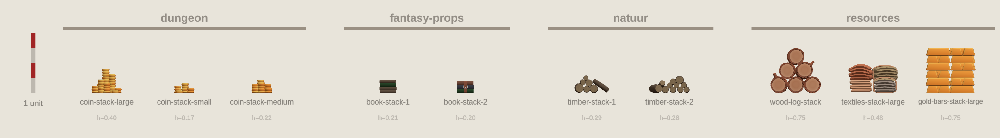

| kit | hoogte | factor | grondvlak | driehoeken/unit | kleuren | modellen |
| --- | ---: | ---: | ---: | ---: | --- | --- |
| resources | 0.75 | 4.50 ⬆ | 0.84 | 3576 | #995a41 #dd9f79 #88796d | wood-log-stack, textiles-stack-large, gold-bars-stack-large |
| natuur | 0.17 | 1.04 | 0.38 | 1180 | #8f785b | timber-stack-1, timber-stack-2 |
| dungeon | 0.16 | 0.96 | 0.26 | 968 | #ffb349 | coin-stack-large, coin-stack-small, coin-stack-medium |
| fantasy-props | 0.10 | 0.62 | 0.14 | 327 | #23562c #8f785b #474a58 | book-stack-1, book-stack-2 |

### grass — spreiding 6.43×

Mediaan over de kits: 0.14 unit hoog. 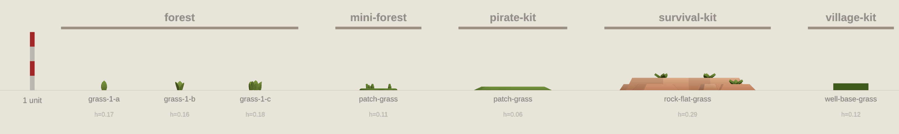

| kit | hoogte | factor | grondvlak | driehoeken/unit | kleuren | modellen |
| --- | ---: | ---: | ---: | ---: | --- | --- |
| quaternius-nature | 0.41 | 2.81 ⬆ | 0.18 | 192 | #23562c | grass, grass-2, grass-short |
| survival-kit | 0.29 | 2.04 ⬆ | 2.32 | 173 | #6d8d33 #dd9f79 | rock-flat-grass |
| forest | 0.17 | 1.17 | 0.17 | 132 | #6d8d33 | grass-1-a, grass-1-b, grass-1-c |
| village-kit | 0.12 | 0.83 | 0.60 | 64 | #6d8d33 | well-base-grass |
| mini-forest | 0.11 | 0.77 | 0.65 | 295 | #6d8d33 | patch-grass |
| pirate-kit | 0.06 | 0.44 ⬇ | 1.34 | 60 | #6d8d33 | patch-grass |

### coin — spreiding 5.81×

Mediaan over de kits: 0.11 unit hoog. 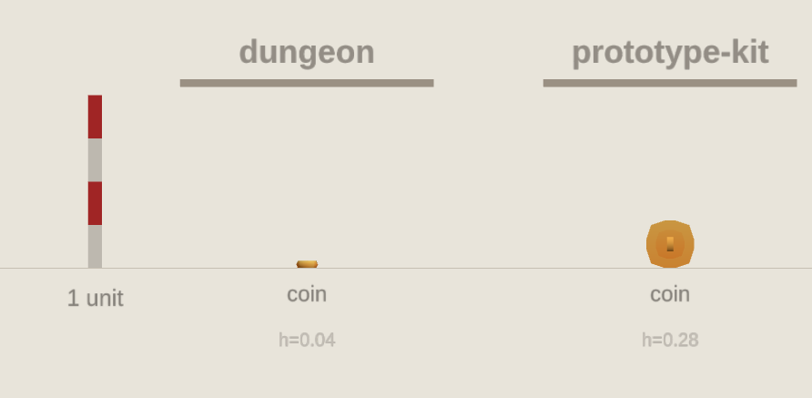

| kit | hoogte | factor | grondvlak | driehoeken/unit | kleuren | modellen |
| --- | ---: | ---: | ---: | ---: | --- | --- |
| prototype-kit | 0.18 | 1.71 | 0.18 | 252 | #ffb349 | coin |
| dungeon | 0.03 | 0.29 ⬇ | 0.09 | 80 | #ffb349 | coin |

### hole — spreiding 5.77×

Mediaan over de kits: 0.09 unit hoog. 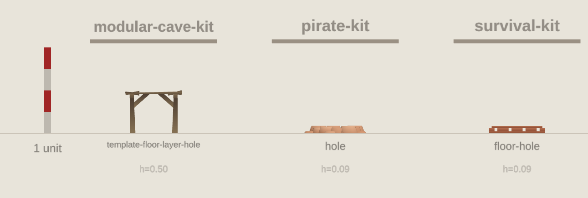

| kit | hoogte | factor | grondvlak | driehoeken/unit | kleuren | modellen |
| --- | ---: | ---: | ---: | ---: | --- | --- |
| modular-cave-kit | 0.50 | 5.58 ⬆ | 0.66 | 384 | #8f785b | template-floor-layer-hole |
| pirate-kit | 0.09 | 1.00 | 0.73 | 286 | #3e3e44 #dd9f79 | hole |
| survival-kit | 0.09 | 0.97 | 0.65 | 144 | #d07b56 | floor-hole |

### plate — spreiding 5.75×

Mediaan over de kits: 0.03 unit hoog. 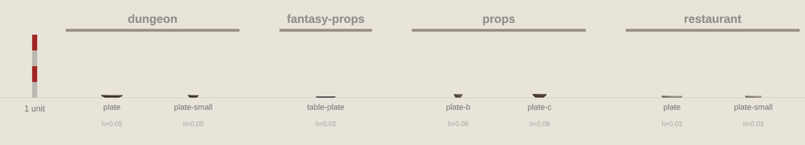

| kit | hoogte | factor | grondvlak | driehoeken/unit | kleuren | modellen |
| --- | ---: | ---: | ---: | ---: | --- | --- |
| props | 0.06 | 2.02 ⬆ | 0.19 | 163 | #88796d | plate-b, plate-c |
| dungeon | 0.03 | 1.12 | 0.18 | 120 | #88796d | plate, plate-small |
| restaurant | 0.03 | 0.88 | 0.21 | 140 | #f4efe3 | plate, plate-small |
| fantasy-props | 0.01 | 0.35 ⬇ | 0.17 | 172 | #6d738a | table-plate |

### ladder — spreiding 5.00×

Mediaan over de kits: 0.65 unit hoog. 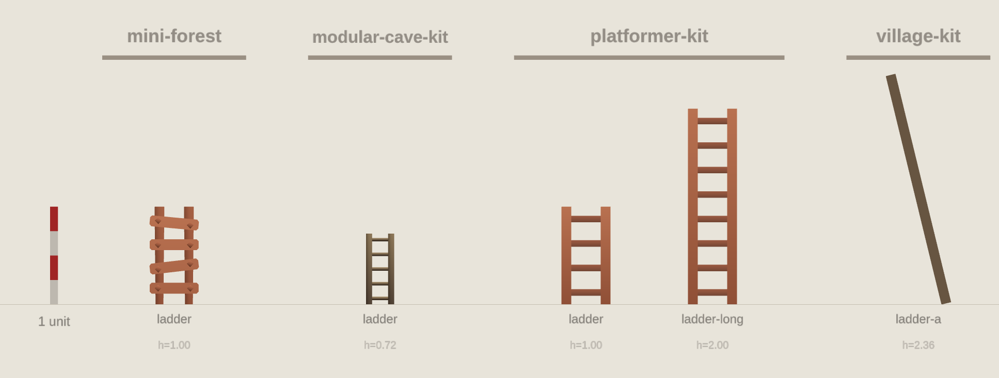

| kit | hoogte | factor | grondvlak | driehoeken/unit | kleuren | modellen |
| --- | ---: | ---: | ---: | ---: | --- | --- |
| village-kit | 2.36 | 3.62 ⬆ | 0.67 | 178 | #8f785b | ladder-a |
| mini-forest | 0.65 | 1.00 | 0.33 | 216 | #d07b56 | ladder |
| platformer-kit | 0.65 | 1.00 | 0.33 | 68 | #995a41 #d07b56 | ladder, ladder-long, ladder-broken |
| modular-cave-kit | 0.47 | 0.72 | 0.19 | 160 | #8f785b | ladder |

### mountain — spreiding 4.83×

Mediaan over de kits: 6.97 unit hoog. 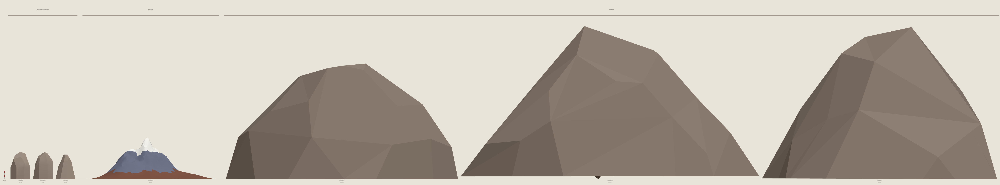

| kit | hoogte | factor | grondvlak | driehoeken/unit | kleuren | modellen |
| --- | ---: | ---: | ---: | ---: | --- | --- |
| natuur | 11.54 | 1.66 | 21.05 | 0 | #88796d | mountain-2, mountain-3, mountain-4 |
| modulair-terrein | 2.39 | 0.34 ⬇ | 1.75 | 6 | #88796d | mountain-a, mountain-b, mountain-c |

### rock — spreiding 4.63×

Mediaan over de kits: 0.27 unit hoog. 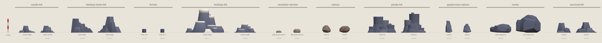

| kit | hoogte | factor | grondvlak | driehoeken/unit | kleuren | modellen |
| --- | ---: | ---: | ---: | ---: | --- | --- |
| pirate-kit | 0.74 | 2.73 ⬆ | 1.20 | 223 | #6d738a | rocks-a, rocks-b, rocks-c |
| fantasy-town-kit | 0.66 | 2.46 ⬆ | 1.02 | 156 | #6d738a | rock-wide, rock-large, rock-small |
| survival-kit | 0.54 | 2.01 ⬆ | 1.02 | 120 | #6d738a #dd9f79 | rock-a, rock-b, rock-c |
| natuur | 0.33 | 1.20 | 0.44 | 96 | #88796d | rock-1, rock-2, rock-3 |
| quaternius-nature | 0.27 | 1.00 | 0.23 | 72 | #6d738a | rock-1, rock-2, rock-3 |
| platformer-kit | 0.26 | 0.96 | 0.43 | 100 | #6d738a | rocks |
| modulair-terrein | 0.19 | 0.71 | 0.35 | 61 | #88796d | hilly-prop-rock-a, hilly-prop-rock-b, hilly-prop-rock-c |
| forest | 0.16 | 0.60 | 0.18 | 48 | #6d738a | rock-1-a, rock-1-b, rock-1-c |
| dungeon | 0.16 | 0.59 | 1.00 | 338 | #88796d #8f785b | floor-tile-large-rocks |

### board — spreiding 4.24×

Mediaan over de kits: 0.10 unit hoog. 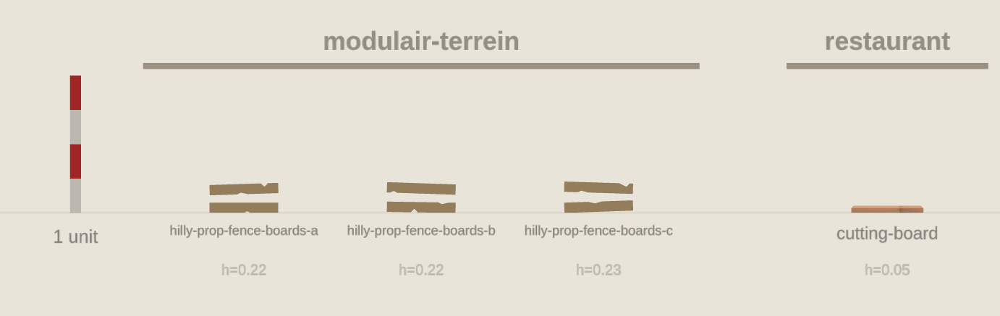

| kit | hoogte | factor | grondvlak | driehoeken/unit | kleuren | modellen |
| --- | ---: | ---: | ---: | ---: | --- | --- |
| modulair-terrein | 0.16 | 1.62 | 0.35 | 52 | #8f785b | hilly-prop-fence-boards-a, hilly-prop-fence-boards-b, hilly-prop-fence-boards-c |
| restaurant | 0.04 | 0.38 ⬇ | 0.37 | 38 | #dd9f79 | cutting-board |

### star — spreiding 4.00×

Mediaan over de kits: 0.15 unit hoog. 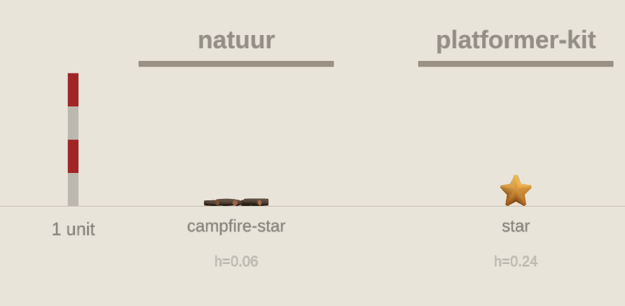

| kit | hoogte | factor | grondvlak | driehoeken/unit | kleuren | modellen |
| --- | ---: | ---: | ---: | ---: | --- | --- |
| platformer-kit | 0.24 | 1.60 | 0.24 | 30 | #ffb349 | star |
| natuur | 0.06 | 0.40 ⬇ | 0.49 | 900 | #8f785b #dd9f79 | campfire-star |

### mushroom — spreiding 3.84×

Mediaan over de kits: 0.09 unit hoog. 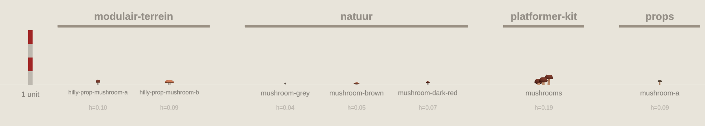

| kit | hoogte | factor | grondvlak | driehoeken/unit | kleuren | modellen |
| --- | ---: | ---: | ---: | ---: | --- | --- |
| platformer-kit | 0.19 | 2.01 ⬆ | 0.34 | 126 | #7f3927 #dd9f79 | mushrooms |
| modulair-terrein | 0.10 | 1.02 | 0.13 | 48 | #f4efe3 #7f3927 #d07b56 | hilly-prop-mushroom-a, hilly-prop-mushroom-b |
| props | 0.09 | 0.98 | 0.08 | 70 | #8f785b #dd9f79 | mushroom-a |
| natuur | 0.05 | 0.52 ⬇ | 0.07 | 216 | #f4efe3 #8f785b #88796d | mushroom-grey, mushroom-brown, mushroom-dark-red |

### post — spreiding 3.45×

Mediaan over de kits: 0.57 unit hoog. 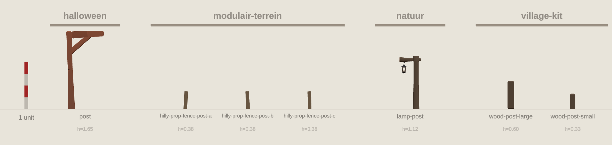

| kit | hoogte | factor | grondvlak | driehoeken/unit | kleuren | modellen |
| --- | ---: | ---: | ---: | ---: | --- | --- |
| halloween | 0.92 | 1.61 | 0.43 | 96 | #995a41 | post |
| natuur | 0.67 | 1.18 | 0.27 | 542 | #3e3e44 #88796d #8f785b | lamp-post |
| village-kit | 0.46 | 0.82 | 0.12 | 24 | #8f785b | wood-post-large, wood-post-small |
| modulair-terrein | 0.27 | 0.47 ⬇ | 0.07 | 18 | #8f785b | hilly-prop-fence-post-a, hilly-prop-fence-post-b, hilly-prop-fence-post-c |

### flower — spreiding 3.43×

Mediaan over de kits: 0.43 unit hoog. 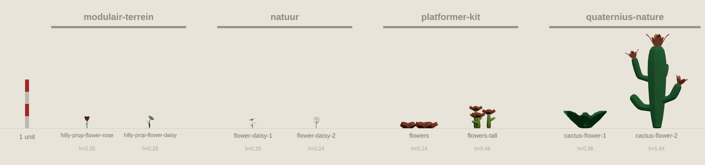

| kit | hoogte | factor | grondvlak | driehoeken/unit | kleuren | modellen |
| --- | ---: | ---: | ---: | ---: | --- | --- |
| quaternius-nature | 0.67 | 1.55 | 0.45 | 1488 | #23562c #995a41 | cactus-flower-1, cactus-flower-2, cactus-flower-3 |
| platformer-kit | 0.19 | 0.45 ⬇ | 0.46 | 331 | #7f3927 #ffb349 #6d8d33 | flowers, flowers-tall |

### blade — spreiding 3.23×

Mediaan over de kits: 2.75 unit hoog. 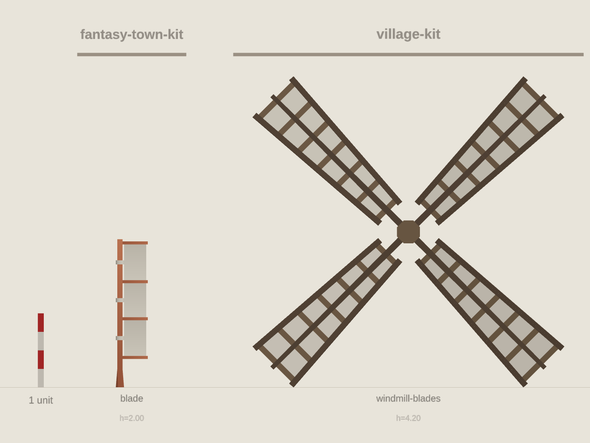

| kit | hoogte | factor | grondvlak | driehoeken/unit | kleuren | modellen |
| --- | ---: | ---: | ---: | ---: | --- | --- |
| village-kit | 4.20 | 1.53 | 4.20 | 59 | #8f785b #f4efe3 | windmill-blades |
| fantasy-town-kit | 1.30 | 0.47 ⬇ | 0.28 | 138 | #d07b56 #f4efe3 | blade |

### plank — spreiding 3.13×

Mediaan over de kits: 0.09 unit hoog. 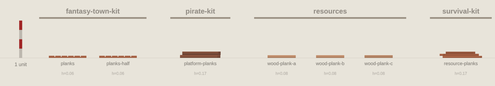

| kit | hoogte | factor | grondvlak | driehoeken/unit | kleuren | modellen |
| --- | ---: | ---: | ---: | ---: | --- | --- |
| survival-kit | 0.12 | 1.33 | 0.81 | 72 | #d07b56 | resource-planks |
| pirate-kit | 0.11 | 1.18 | 0.69 | 48 | #995a41 #d07b56 | platform-planks |
| resources | 0.07 | 0.82 | 0.75 | 52 | #dd9f79 | wood-plank-a, wood-plank-b, wood-plank-c |
| fantasy-town-kit | 0.04 | 0.42 ⬇ | 0.65 | 90 | #d07b56 | planks, planks-half |

### dirt — spreiding 3.13×

Mediaan over de kits: 0.11 unit hoog. 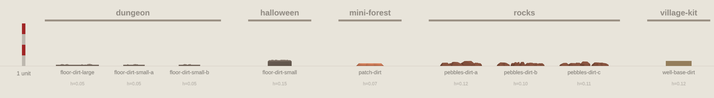

| kit | hoogte | factor | grondvlak | driehoeken/unit | kleuren | modellen |
| --- | ---: | ---: | ---: | ---: | --- | --- |
| halloween | 0.15 | 1.36 | 0.56 | 80 | #88796d | floor-dirt-small |
| village-kit | 0.12 | 1.11 | 0.60 | 64 | #8f785b | well-base-dirt |
| rocks | 0.11 | 1.00 | 1.11 | 247 | #995a41 | pebbles-dirt-a, pebbles-dirt-b, pebbles-dirt-c |
| mini-forest | 0.07 | 0.60 | 0.65 | 108 | #d07b56 | patch-dirt |
| dungeon | 0.05 | 0.44 ⬇ | 0.50 | 45 | #88796d | floor-dirt-large, floor-dirt-small-a, floor-dirt-small-b |

### crate — spreiding 3.06×

Mediaan over de kits: 0.33 unit hoog. 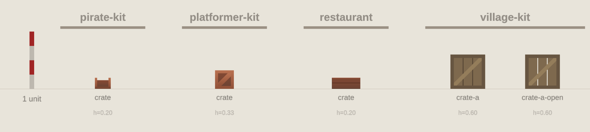

| kit | hoogte | factor | grondvlak | driehoeken/unit | kleuren | modellen |
| --- | ---: | ---: | ---: | ---: | --- | --- |
| village-kit | 0.60 | 1.85 ⬆ | 0.60 | 460 | #8f785b | crate-a, crate-a-open |
| fantasy-props | 0.45 | 1.38 | 0.44 | 2157 | #995a41 #8f785b #9da4c4 | crate-metal, crate-wooden |
| platformer-kit | 0.33 | 1.00 | 0.33 | 156 | #995a41 #d07b56 | crate |
| pirate-kit | 0.20 | 0.60 | 0.33 | 76 | #995a41 #d07b56 | crate |
| restaurant | 0.20 | 0.60 | 0.49 | 132 | #995a41 | crate |

### fence — spreiding 2.72×

Mediaan over de kits: 0.26 unit hoog. 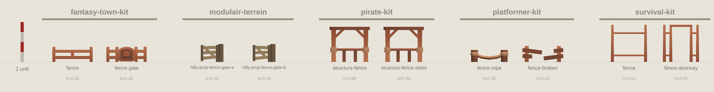

| kit | hoogte | factor | grondvlak | driehoeken/unit | kleuren | modellen |
| --- | ---: | ---: | ---: | ---: | --- | --- |
| survival-kit | 0.67 | 2.57 ⬆ | 0.65 | 84 | #d07b56 | fence, fence-fortified |
| pirate-kit | 0.56 | 2.13 ⬆ | 0.64 | 396 | #995a41 #d07b56 #dd9f79 | structure-fence, structure-fence-sides |
| modulair-terrein | 0.26 | 1.00 | 0.75 | 88 | #8f785b | hilly-prop-fence-curve-1x1, hilly-prop-fence-curve-2x2, hilly-prop-fence-curve-3x3 |
| platformer-kit | 0.26 | 0.99 | 0.65 | 92 | #995a41 #d07b56 | fence-broken, fence-corner, fence-straight |
| fantasy-town-kit | 0.25 | 0.94 | 0.65 | 124 | #d07b56 #f4efe3 | fence, fence-broken, fence-curved |

### glass — spreiding 2.44×

Mediaan over de kits: 0.46 unit hoog. 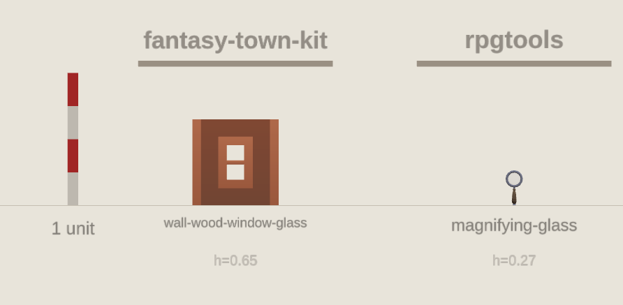

| kit | hoogte | factor | grondvlak | driehoeken/unit | kleuren | modellen |
| --- | ---: | ---: | ---: | ---: | --- | --- |
| fantasy-town-kit | 0.65 | 1.42 | 0.65 | 122 | #995a41 #d07b56 | wall-wood-window-glass |
| rpgtools | 0.27 | 0.58 | 0.13 | 570 | #6d738a #8f785b #ffffff | magnifying-glass |

### candle — spreiding 2.27×

Mediaan over de kits: 0.22 unit hoog. 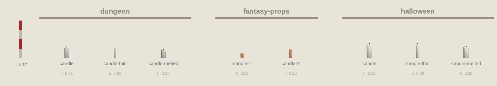

| kit | hoogte | factor | grondvlak | driehoeken/unit | kleuren | modellen |
| --- | ---: | ---: | ---: | ---: | --- | --- |
| dungeon | 0.22 | 1.00 | 0.08 | 66 | #8f785b #f4efe3 | candle, candle-thin, candle-melted |
| halloween | 0.22 | 1.00 | 0.08 | 66 | #995a41 #f4efe3 | candle, candle-thin, candle-melted |
| fantasy-props | 0.10 | 0.44 ⬇ | 0.05 | 211 | #6d738a #dd9f79 #ffb349 | candle-1, candle-2 |

### log — spreiding 2.24×

Mediaan over de kits: 0.31 unit hoog. 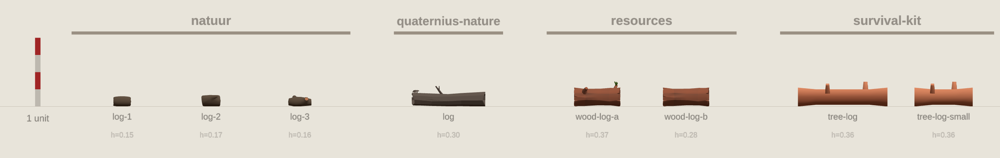

| kit | hoogte | factor | grondvlak | driehoeken/unit | kleuren | modellen |
| --- | ---: | ---: | ---: | ---: | --- | --- |
| survival-kit | 0.36 | 1.16 | 1.07 | 88 | #d07b56 #dd9f79 | tree-log, tree-log-small |
| resources | 0.32 | 1.04 | 0.68 | 668 | #995a41 #dd9f79 #6d8d33 | wood-log-a, wood-log-b |
| quaternius-nature | 0.30 | 0.96 | 1.07 | 464 | #88796d | log |
| natuur | 0.16 | 0.52 ⬇ | 0.28 | 402 | #8f785b #dd9f79 | log-1, log-2, log-3 |

### pile — spreiding 2.18×

Mediaan over de kits: 0.26 unit hoog. 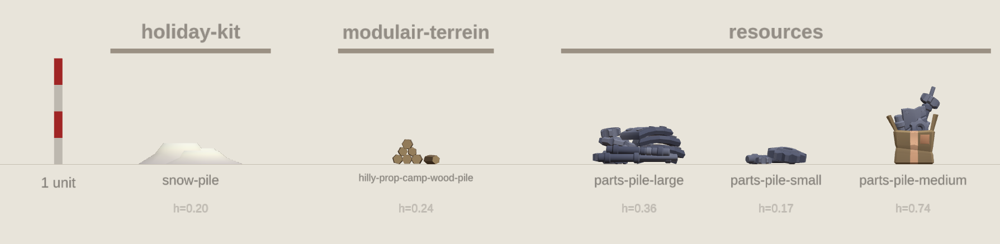

| kit | hoogte | factor | grondvlak | driehoeken/unit | kleuren | modellen |
| --- | ---: | ---: | ---: | ---: | --- | --- |
| resources | 0.36 | 1.37 | 0.58 | 1556 | #6d738a #474a58 #8f785b | parts-pile-large, parts-pile-small, parts-pile-medium |
| modulair-terrein | 0.17 | 0.63 | 0.31 | 318 | #8f785b | hilly-prop-camp-wood-pile |

### lantern — spreiding 2.11×

Mediaan over de kits: 0.48 unit hoog. 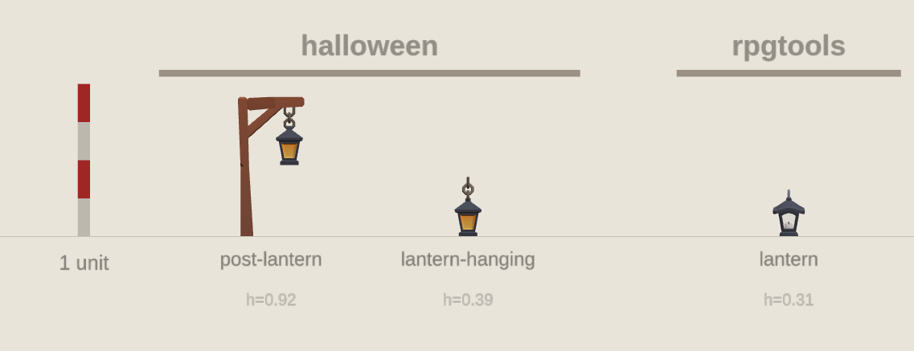

| kit | hoogte | factor | grondvlak | driehoeken/unit | kleuren | modellen |
| --- | ---: | ---: | ---: | ---: | --- | --- |
| halloween | 0.65 | 1.36 | 0.31 | 520 | #474a58 #88796d #ffb349 | post-lantern, lantern-hanging |
| rpgtools | 0.31 | 0.64 | 0.21 | 772 | #3e3e44 #474a58 #6d738a | lantern |

### tree — spreiding 2.08×

Mediaan over de kits: 1.42 unit hoog. 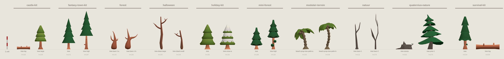

| kit | hoogte | factor | grondvlak | driehoeken/unit | kleuren | modellen |
| --- | ---: | ---: | ---: | ---: | --- | --- |
| survival-kit | 2.03 | 1.43 | 0.72 | 119 | #23562c #d07b56 | tree, tree-tall |
| fantasy-town-kit | 1.79 | 1.26 | 0.67 | 104 | #23562c #d07b56 | tree, tree-high, tree-high-round |
| natuur | 1.55 | 1.09 | 0.35 | 64 | #88796d | tree-bare-1, tree-bare-2, tree-bare-3 |
| mini-forest | 1.29 | 0.91 | 0.60 | 173 | #23562c #d07b56 | tree, tree-high |
| halloween | 1.16 | 0.82 | 0.50 | 184 | #995a41 | tree-dead-large, tree-dead-small, tree-dead-medium |
| forest | 0.97 | 0.69 | 0.59 | 332 | #d07b56 #7f3927 | tree-bare-1-a, tree-bare-1-b, tree-bare-1-c |

### stool — spreiding 2.07×

Mediaan over de kits: 0.19 unit hoog. 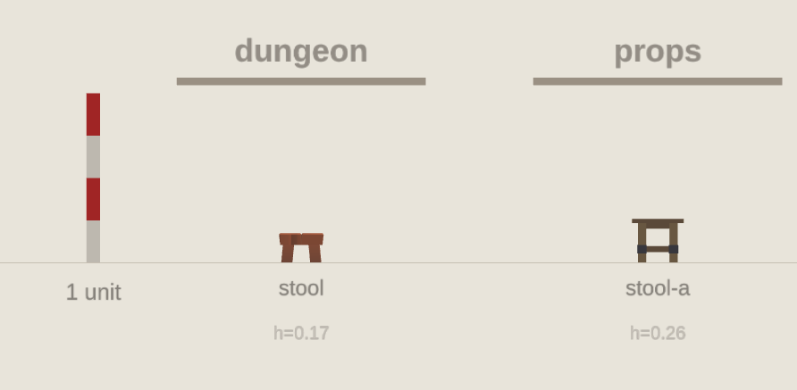

| kit | hoogte | factor | grondvlak | driehoeken/unit | kleuren | modellen |
| --- | ---: | ---: | ---: | ---: | --- | --- |
| props | 0.26 | 1.35 | 0.31 | 268 | #3e3e44 #8f785b | stool-a |
| dungeon | 0.13 | 0.65 | 0.19 | 172 | #995a41 | stool |

### stump — spreiding 2.06×

Mediaan over de kits: 0.21 unit hoog. 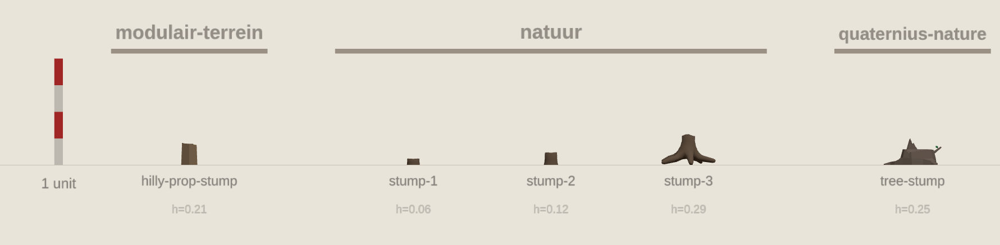

| kit | hoogte | factor | grondvlak | driehoeken/unit | kleuren | modellen |
| --- | ---: | ---: | ---: | ---: | --- | --- |
| quaternius-nature | 0.25 | 1.19 | 0.54 | 232 | #23562c #88796d | tree-stump |
| modulair-terrein | 0.21 | 1.00 | 0.17 | 100 | #8f785b | hilly-prop-stump |
| natuur | 0.12 | 0.58 | 0.14 | 220 | #8f785b #dd9f79 | stump-1, stump-2, stump-3 |

### barrel — spreiding 1.99×

Mediaan over de kits: 0.47 unit hoog. 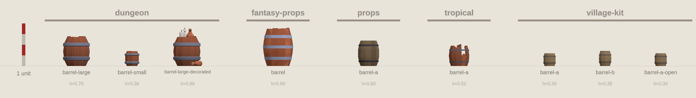

| kit | hoogte | factor | grondvlak | driehoeken/unit | kleuren | modellen |
| --- | ---: | ---: | ---: | ---: | --- | --- |
| props | 0.60 | 1.26 | 0.49 | 428 | #3e3e44 #8f785b | barrel-a |
| dungeon | 0.50 | 1.05 | 0.45 | 561 | #6d738a #995a41 #d07b56 | barrel-large, barrel-small, barrel-large-decorated |
| fantasy-props | 0.45 | 0.95 | 0.35 | 824 | #9da4c4 #d07b56 | barrel |
| village-kit | 0.30 | 0.63 | 0.29 | 480 | #88796d #8f785b | barrel-a, barrel-b, barrel-a-open |

### stair — spreiding 1.96×

Mediaan over de kits: 1.10 unit hoog. 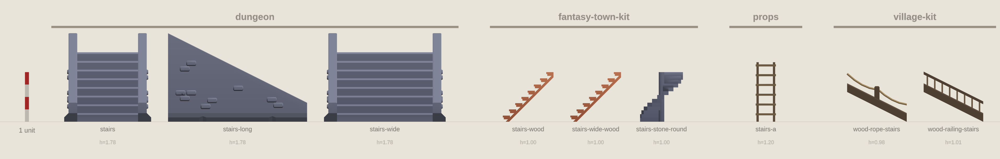

| kit | hoogte | factor | grondvlak | driehoeken/unit | kleuren | modellen |
| --- | ---: | ---: | ---: | ---: | --- | --- |
| dungeon | 1.27 | 1.16 | 1.75 | 160 | #474a58 #6d738a | stairs, stairs-long, stairs-wide |
| props | 1.20 | 1.09 | 0.41 | 87 | #8f785b | stairs-a |
| village-kit | 1.00 | 0.91 | 1.21 | 140 | #8f785b | wood-rope-stairs, wood-railing-stairs |
| fantasy-town-kit | 0.65 | 0.59 | 0.66 | 424 | #d07b56 #6d738a | stairs-wood, stairs-wide-wood, stairs-stone-round |

### ramp — spreiding 1.96×

Mediaan over de kits: 0.55 unit hoog. 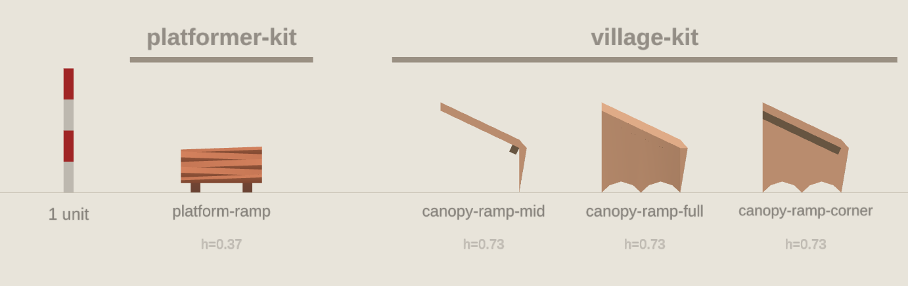

| kit | hoogte | factor | grondvlak | driehoeken/unit | kleuren | modellen |
| --- | ---: | ---: | ---: | ---: | --- | --- |
| village-kit | 0.73 | 1.32 | 0.69 | 86 | #8f785b #dd9f79 | canopy-ramp-mid, canopy-ramp-full, canopy-ramp-corner |
| platformer-kit | 0.37 | 0.68 | 0.67 | 84 | #995a41 #d07b56 | platform-ramp |

### table — spreiding 1.96×

Mediaan over de kits: 0.25 unit hoog. 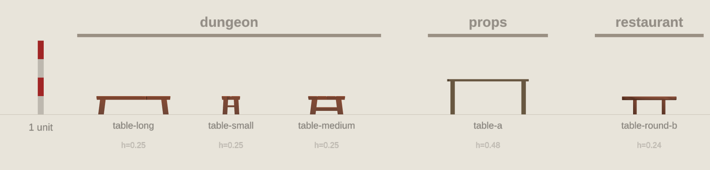

| kit | hoogte | factor | grondvlak | driehoeken/unit | kleuren | modellen |
| --- | ---: | ---: | ---: | ---: | --- | --- |
| props | 0.48 | 1.92 ⬆ | 1.10 | 132 | #8f785b | table-a |
| dungeon | 0.25 | 1.00 | 0.50 | 256 | #995a41 #d07b56 | table-long, table-small, table-medium |
| restaurant | 0.24 | 0.98 | 0.73 | 300 | #995a41 | table-round-b |

### anvil — spreiding 1.95×

Mediaan over de kits: 0.33 unit hoog. 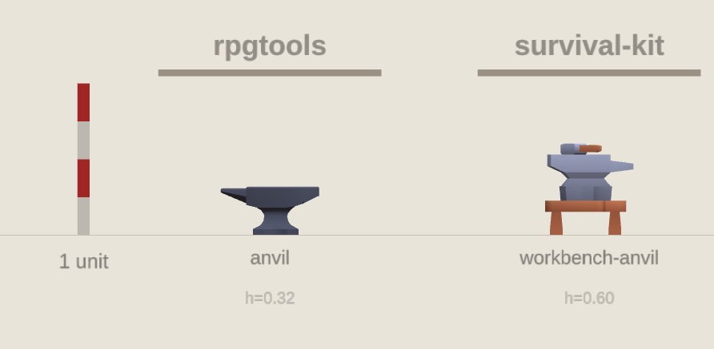

| kit | hoogte | factor | grondvlak | driehoeken/unit | kleuren | modellen |
| --- | ---: | ---: | ---: | ---: | --- | --- |
| survival-kit | 0.44 | 1.32 | 0.42 | 298 | #9da4c4 #d07b56 | workbench-anvil |
| rpgtools | 0.22 | 0.68 | 0.45 | 316 | #6d738a | anvil |

### bucket — spreiding 1.92×

Mediaan over de kits: 0.21 unit hoog. 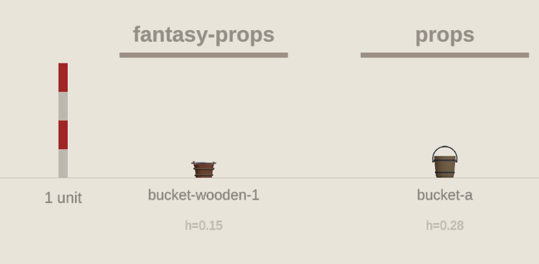

| kit | hoogte | factor | grondvlak | driehoeken/unit | kleuren | modellen |
| --- | ---: | ---: | ---: | ---: | --- | --- |
| props | 0.28 | 1.32 | 0.22 | 864 | #3e3e44 #474a58 #8f785b | bucket-a |
| fantasy-props | 0.15 | 0.68 | 0.22 | 976 | #6d738a #8f785b #995a41 | bucket-wooden-1 |

### bench — spreiding 1.92×

Mediaan over de kits: 0.26 unit hoog. 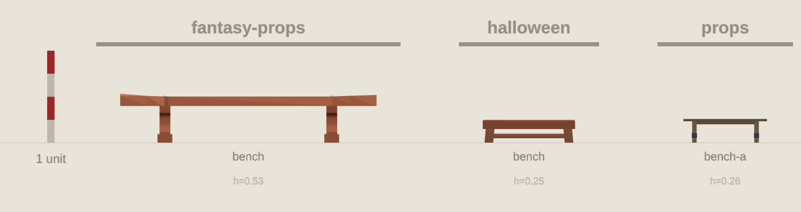

| kit | hoogte | factor | grondvlak | driehoeken/unit | kleuren | modellen |
| --- | ---: | ---: | ---: | ---: | --- | --- |
| fantasy-props | 0.27 | 1.03 | 1.39 | 404 | #d07b56 #f4efe3 | bench |
| props | 0.26 | 1.00 | 0.91 | 204 | #3e3e44 #8f785b | bench-a |
| halloween | 0.14 | 0.54 ⬇ | 0.56 | 172 | #995a41 | bench |

### window — spreiding 1.87×

Mediaan over de kits: 0.60 unit hoog. 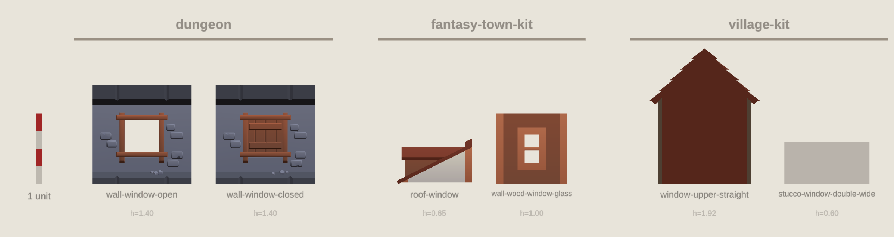

| kit | hoogte | factor | grondvlak | driehoeken/unit | kleuren | modellen |
| --- | ---: | ---: | ---: | ---: | --- | --- |
| dungeon | 1.00 | 1.67 | 1.00 | 634 | #474a58 #6d738a #995a41 | wall-window-open, wall-window-closed |
| village-kit | 0.60 | 1.00 | 1.20 | 216 | #8f785b #9da4c4 #f4efe3 | stucco-window-double-wide, stucco-window-single-wide, stucco-window-double-narrow |
| fantasy-town-kit | 0.54 | 0.89 | 0.67 | 235 | #995a41 #d07b56 #7f3927 | roof-window, wall-wood-window-round |

### doorway — spreiding 1.85×

Mediaan over de kits: 0.84 unit hoog. 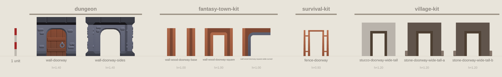

| kit | hoogte | factor | grondvlak | driehoeken/unit | kleuren | modellen |
| --- | ---: | ---: | ---: | ---: | --- | --- |
| village-kit | 1.20 | 1.43 | 1.38 | 667 | #8f785b #88796d #f4efe3 | stucco-doorway-wide-tall, stone-doorway-wide-tall-a, stone-doorway-wide-tall-b |
| dungeon | 1.00 | 1.20 | 1.13 | 998 | #474a58 #6d738a #995a41 | wall-doorway, wall-doorway-sides |
| survival-kit | 0.67 | 0.80 | 0.65 | 108 | #d07b56 | fence-doorway |
| fantasy-town-kit | 0.65 | 0.78 | 0.65 | 82 | #995a41 #d07b56 #6d738a | wall-wood-doorway-base, wall-wood-doorway-square, wall-wood-doorway-square-wide-curved |

### roof — spreiding 1.84×

Mediaan over de kits: 0.79 unit hoog. 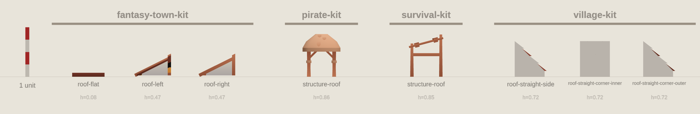

| kit | hoogte | factor | grondvlak | driehoeken/unit | kleuren | modellen |
| --- | ---: | ---: | ---: | ---: | --- | --- |
| pirate-kit | 0.86 | 1.10 | 0.82 | 348 | #d07b56 #dd9f79 | structure-roof |
| survival-kit | 0.85 | 1.09 | 0.72 | 188 | #d07b56 | structure-roof |
| village-kit | 0.72 | 0.91 | 0.64 | 88 | #7f3927 #f4efe3 | roof-straight-side, roof-straight-corner-inner, roof-straight-corner-outer |
| fantasy-town-kit | 0.47 | 0.59 | 0.74 | 84 | #7f3927 #d07b56 #f4efe3 | roof-flat, roof-left, roof-right |

### floor — spreiding 1.81×

Mediaan over de kits: 0.06 unit hoog. 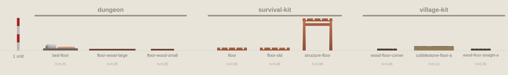

| kit | hoogte | factor | grondvlak | driehoeken/unit | kleuren | modellen |
| --- | ---: | ---: | ---: | ---: | --- | --- |
| survival-kit | 0.07 | 1.12 | 0.65 | 84 | #d07b56 | floor, floor-old, structure-floor |
| village-kit | 0.06 | 1.00 | 0.60 | 116 | #8f785b #88796d | wood-floor-corner, cobblestone-floor-a, wood-floor-straight-a |
| dungeon | 0.04 | 0.62 | 0.75 | 232 | #995a41 #88796d #dd9f79 | bed-floor, floor-wood-large, floor-wood-small |

### bottle — spreiding 1.81×

Mediaan over de kits: 0.19 unit hoog. 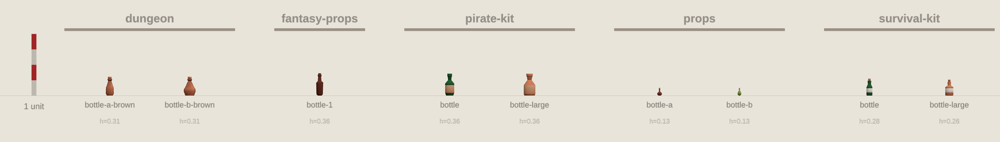

| kit | hoogte | factor | grondvlak | driehoeken/unit | kleuren | modellen |
| --- | ---: | ---: | ---: | ---: | --- | --- |
| pirate-kit | 0.23 | 1.17 | 0.12 | 124 | #dd9f79 #23562c #d07b56 | bottle, bottle-large, crate-bottles |
| dungeon | 0.22 | 1.14 | 0.14 | 144 | #7f3927 #d07b56 #dd9f79 | bottle-a-brown, bottle-b-brown, bottle-c-brown |
| survival-kit | 0.19 | 1.00 | 0.09 | 96 | #d07b56 #f4efe3 #23562c | bottle, bottle-large |
| fantasy-props | 0.18 | 0.94 | 0.06 | 312 | #7f3927 #8f785b | bottle-1 |
| props | 0.13 | 0.65 | 0.06 | 188 | #8f785b #7f3927 #6d8d33 | bottle-a, bottle-b, bottle-c |

