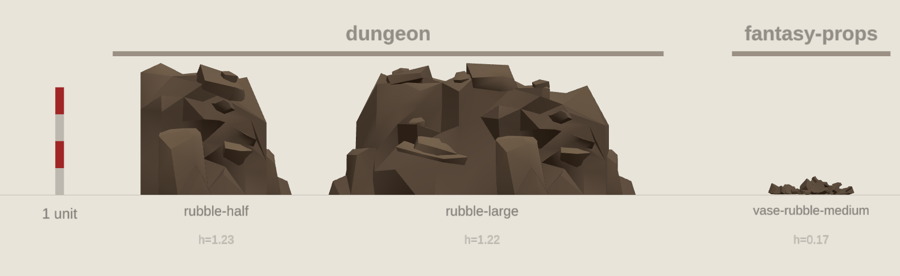
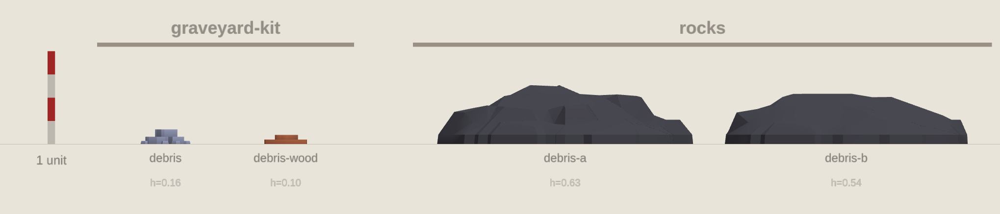
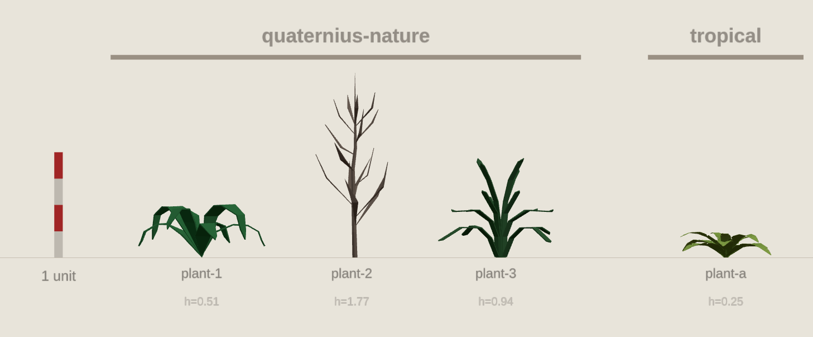
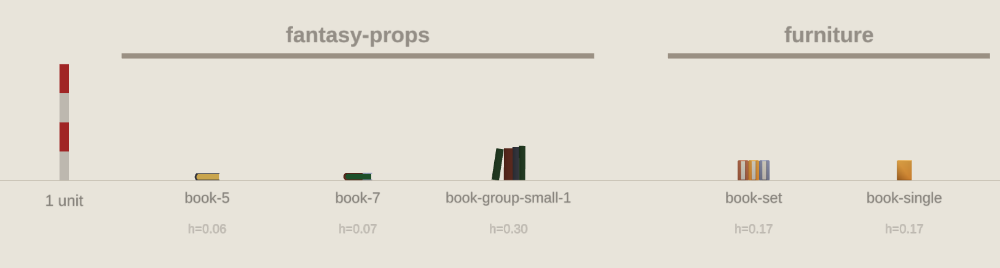
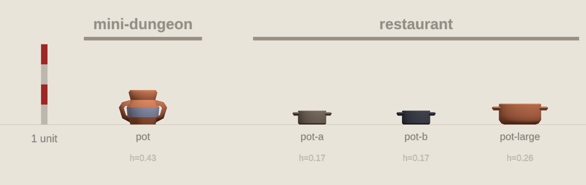

# Inconsistenties tussen kits

Afgeleid uit `onderwerpen.json` en `catalog/catalog.json`, over dezelfde modellen
als in de renders. Per onderwerp is de mediane hoogte per kit vergeleken met de
mediaan over alle kits; een factor van 1.00 is dus "net als de rest".

```sh
node tools/vergelijk-groottes/afwijkingen.mjs
```

Onderwerpen met meer dan één kit: 83. Daarvan met een spreiding van
1.8× of meer tussen grootste en kleinste kit: 46.

## Kits die er structureel uit springen

`factor` is het meetkundig gemiddelde over alle onderwerpen van die kit.

| kit | factor | te groot bij | te klein bij | veel dichter mesh bij |
| --- | ---: | --- | --- | --- |
| fantasy-props | 0.87 | bench, shelf | key, plate, rubble | candle, crate |
| village-kit | 0.85 | ladder | arch, barrel, grass, wall | crate |
| pirate-kit | 1.25 | fence, rock, rope | grass | fence |
| dungeon | 0.91 | key | coin, column, rock | pillar, wall |
| rocks | 2.80 | arch, column, wall | – | dirt |
| quaternius-nature | 1.86 | grass, log, stump | – | pine |
| platformer-kit | 0.92 | mushroom | flower, rope | – |
| natuur | 0.91 | mountain | balloon, star | post |
| halloween | 1.34 | dirt, post | – | – |
| survival-kit | 1.17 | fence, grass | – | – |
| graveyard-kit | 1.08 | dirt | debris | dirt, pine, rock |
| fantasy-town-kit | 0.98 | rock | plank | stair |
| modulair-terrein | 0.93 | – | post, rock | rope |
| rpgtools | 0.83 | – | glass, lantern | shovel |
| modular-cave-kit | 1.99 | hole | – | – |
| taalei-kit | 1.86 | balloon | – | – |
| resources | 1.29 | stack | – | pile, stack |
| props | 0.94 | – | bottle | – |
| tropical | 0.81 | – | plant | – |
| forest | 0.81 | – | rock | – |
| restaurant | 0.71 | – | board | – |
| mini-dungeon | 1.42 | – | – | – |
| prototype-kit | 1.16 | – | – | – |
| furniture | 1.11 | – | – | – |
| holiday-kit | 1.09 | – | – | – |
| nature | 0.95 | – | – | tree |
| mini-forest | 0.90 | – | – | grass |
| castle-kit | 0.87 | – | – | – |

## Per onderwerp

### arch — spreiding 22.10×

Mediaan over de kits: 1.00 unit hoog. 

| kit | hoogte | factor | grondvlak | driehoeken/unit | kleuren | modellen |
| --- | ---: | ---: | ---: | ---: | --- | --- |
| rocks | 9.28 | 9.28 ⬆ | 18.39 | 2 | #6d738a | rockform-arch |
| fantasy-town-kit | 1.00 | 1.00 | 0.65 | 89 | #6d738a #995a41 #d07b56 | wall-wood-arch, wall-wood-arch-top |
| village-kit | 0.42 | 0.42 ⬇ | 0.66 | 44 | #f4efe3 #88796d #8f785b | stone-arch, stucco-arch-half, stucco-arch-half-outer |

### column — spreiding 15.17×

Mediaan over de kits: 3.96 unit hoog. 

| kit | hoogte | factor | grondvlak | driehoeken/unit | kleuren | modellen |
| --- | ---: | ---: | ---: | ---: | --- | --- |
| rocks | 7.43 | 1.88 ⬆ | 6.18 | 1 | #6d738a | rockform-column |
| dungeon | 0.49 | 0.12 ⬇ | 0.24 | 44 | #6d738a | column |

### balloon — spreiding 13.53×

Mediaan over de kits: 2.67 unit hoog. 

| kit | hoogte | factor | grondvlak | driehoeken/unit | kleuren | modellen |
| --- | ---: | ---: | ---: | ---: | --- | --- |
| taalei-kit | 4.98 | 1.86 ⬆ | 3.74 | 13 | #3e3e44 #6d738a #d07b56 | balloon |
| natuur | 0.37 | 0.14 ⬇ | 0.23 | 79 | #23562c #2473b3 #6d8d33 | flower-balloon-1, flower-balloon-2, flower-balloon-3 |

### wall — spreiding 12.79×

Mediaan over de kits: 1.20 unit hoog. 

| kit | hoogte | factor | grondvlak | driehoeken/unit | kleuren | modellen |
| --- | ---: | ---: | ---: | ---: | --- | --- |
| rocks | 7.67 | 6.39 ⬆ | 11.49 | 1 | #6d738a | rockform-wall-long, rockform-wall-short-a, rockform-wall-short-b |
| dungeon | 1.40 | 1.17 | 1.40 | 353 | #474a58 #6d738a | wall, wall-half, wall-broken |
| fantasy-town-kit | 1.00 | 0.83 | 1.00 | 32 | #d07b56 #995a41 | wall-wood, balcony-wall, wall-wood-half |
| village-kit | 0.60 | 0.50 ⬇ | 0.60 | 122 | #88796d #3e3e44 #8f785b | lamp-wall, stone-wall-a, stone-wall-b |

### key — spreiding 11.75×

Mediaan over de kits: 0.08 unit hoog. 

| kit | hoogte | factor | grondvlak | driehoeken/unit | kleuren | modellen |
| --- | ---: | ---: | ---: | ---: | --- | --- |
| dungeon | 0.14 | 1.84 ⬆ | 0.31 | 160 | #6d738a | key |
| fantasy-props | 0.01 | 0.16 ⬇ | 0.12 | 956 | #ffb349 #88796d | key-gold, key-metal |

### rope — spreiding 10.52×

Mediaan over de kits: 0.75 unit hoog. 

| kit | hoogte | factor | grondvlak | driehoeken/unit | kleuren | modellen |
| --- | ---: | ---: | ---: | ---: | --- | --- |
| pirate-kit | 3.15 | 4.19 ⬆ | 1.75 | 67 | #474a58 #995a41 #d07b56 | mast-ropes |
| modulair-terrein | 1.01 | 1.34 | 1.67 | 1473 | #6d8d33 #88796d #8f785b | cliff-prop-bridge-rope-end |
| village-kit | 0.49 | 0.66 | 0.63 | 124 | #8f785b | wood-rope-corner, wood-rope-straight |
| platformer-kit | 0.30 | 0.40 ⬇ | 0.95 | 180 | #995a41 #d07b56 #dd9f79 | fence-rope |

### grass — spreiding 10.13×

Mediaan over de kits: 0.23 unit hoog. 

| kit | hoogte | factor | grondvlak | driehoeken/unit | kleuren | modellen |
| --- | ---: | ---: | ---: | ---: | --- | --- |
| quaternius-nature | 1.01 | 4.49 ⬆ | 0.44 | 190 | #23562c | grass, grass-2, grass-short |
| survival-kit | 0.41 | 1.80 ⬆ | 3.22 | 90 | #6d8d33 #dd9f79 | rock-flat-grass |
| forest | 0.28 | 1.24 | 0.28 | 132 | #6d8d33 | grass-1-a, grass-1-b, grass-1-c |
| mini-forest | 0.17 | 0.76 | 1.00 | 295 | #6d8d33 | patch-grass |
| village-kit | 0.12 | 0.53 ⬇ | 0.60 | 64 | #6d8d33 | well-base-grass |
| pirate-kit | 0.10 | 0.44 ⬇ | 2.11 | 24 | #6d8d33 | patch-grass |

### dirt — spreiding 10.02×

Mediaan over de kits: 0.11 unit hoog. 

| kit | hoogte | factor | grondvlak | driehoeken/unit | kleuren | modellen |
| --- | ---: | ---: | ---: | ---: | --- | --- |
| graveyard-kit | 0.66 | 5.80 ⬆ | 0.62 | 280 | #9da4c4 #d07b56 | shovel-dirt |
| halloween | 0.27 | 2.32 ⬆ | 1.00 | 80 | #88796d | floor-dirt-small |
| village-kit | 0.12 | 1.05 | 0.60 | 64 | #8f785b | well-base-dirt |
| rocks | 0.11 | 0.95 | 1.11 | 247 | #995a41 | pebbles-dirt-a, pebbles-dirt-b, pebbles-dirt-c |
| mini-forest | 0.10 | 0.88 | 1.00 | 108 | #d07b56 | patch-dirt |
| dungeon | 0.07 | 0.58 | 0.70 | 45 | #88796d | floor-dirt-large, floor-dirt-small-a, floor-dirt-small-b |

### rubble — spreiding 7.00×

Mediaan over de kits: 0.70 unit hoog. 

| kit | hoogte | factor | grondvlak | driehoeken/unit | kleuren | modellen |
| --- | ---: | ---: | ---: | ---: | --- | --- |
| dungeon | 1.22 | 1.75 | 2.12 | 210 | #8f785b | rubble-half, rubble-large |
| fantasy-props | 0.17 | 0.25 ⬇ | 0.80 | 1113 | #8f785b | vase-rubble-medium |

### hole — spreiding 6.43×

Mediaan over de kits: 0.14 unit hoog. 

| kit | hoogte | factor | grondvlak | driehoeken/unit | kleuren | modellen |
| --- | ---: | ---: | ---: | ---: | --- | --- |
| modular-cave-kit | 0.77 | 5.44 ⬆ | 1.01 | 380 | #8f785b | template-floor-layer-hole |
| pirate-kit | 0.14 | 1.00 | 1.14 | 231 | #3e3e44 #dd9f79 | hole |
| survival-kit | 0.12 | 0.85 | 0.90 | 144 | #d07b56 | floor-hole |

### coin — spreiding 6.30×

Mediaan over de kits: 0.16 unit hoog. 

| kit | hoogte | factor | grondvlak | driehoeken/unit | kleuren | modellen |
| --- | ---: | ---: | ---: | ---: | --- | --- |
| prototype-kit | 0.28 | 1.73 | 0.28 | 252 | #ffb349 | coin |
| dungeon | 0.04 | 0.27 ⬇ | 0.13 | 80 | #ffb349 | coin |

### mountain — spreiding 5.63×

Mediaan over de kits: 5.26 unit hoog. 

| kit | hoogte | factor | grondvlak | driehoeken/unit | kleuren | modellen |
| --- | ---: | ---: | ---: | ---: | --- | --- |
| natuur | 19.24 | 3.66 ⬆ | 35.08 | 0 | #88796d | mountain-2, mountain-3, mountain-4 |
| nature | 5.26 | 1.00 | 16.67 | 1 | #6d738a #995a41 #f4efe3 | mountain-a |
| modulair-terrein | 3.42 | 0.65 | 2.50 | 2 | #88796d | mountain-a, mountain-b, mountain-c |

### flower — spreiding 5.57×

Mediaan over de kits: 0.98 unit hoog. 

| kit | hoogte | factor | grondvlak | driehoeken/unit | kleuren | modellen |
| --- | ---: | ---: | ---: | ---: | --- | --- |
| quaternius-nature | 1.67 | 1.70 | 1.12 | 767 | #23562c #995a41 | cactus-flower-1, cactus-flower-2, cactus-flower-3 |
| platformer-kit | 0.30 | 0.30 ⬇ | 0.70 | 331 | #7f3927 #ffb349 #6d8d33 | flowers, flowers-tall |

### rock — spreiding 5.20×

Mediaan over de kits: 0.52 unit hoog. 

| kit | hoogte | factor | grondvlak | driehoeken/unit | kleuren | modellen |
| --- | ---: | ---: | ---: | ---: | --- | --- |
| pirate-kit | 1.16 | 2.22 ⬆ | 1.88 | 63 | #6d738a | rocks-a, rocks-b, rocks-c |
| fantasy-town-kit | 1.02 | 1.96 ⬆ | 1.57 | 89 | #6d738a | rock-wide, rock-large, rock-small |
| holiday-kit | 0.88 | 1.69 | 1.98 | 97 | #6d738a #f4efe3 | rocks-large, rocks-small, rocks-medium |
| survival-kit | 0.75 | 1.45 | 1.41 | 83 | #6d738a #dd9f79 | rock-a, rock-b, rock-c |
| quaternius-nature | 0.68 | 1.30 | 0.56 | 72 | #6d738a | rock-1, rock-2, rock-3 |
| natuur | 0.54 | 1.04 | 0.73 | 96 | #88796d | rock-1, rock-2, rock-3 |
| castle-kit | 0.50 | 0.96 | 1.23 | 108 | #6d738a #f4efe3 | rocks-large, rocks-small |
| graveyard-kit | 0.48 | 0.93 | 1.05 | 348 | #9da4c4 | rocks, rocks-tall |
| platformer-kit | 0.40 | 0.77 | 0.66 | 100 | #6d738a | rocks |
| modulair-terrein | 0.28 | 0.53 ⬇ | 0.50 | 61 | #88796d | hilly-prop-rock-a, hilly-prop-rock-b, hilly-prop-rock-c |
| forest | 0.27 | 0.52 ⬇ | 0.30 | 48 | #6d738a | rock-1-a, rock-1-b, rock-1-c |
| dungeon | 0.22 | 0.43 ⬇ | 1.40 | 172 | #88796d #8f785b | floor-tile-large-rocks |

### debris — spreiding 4.53×

Mediaan over de kits: 0.36 unit hoog. 

| kit | hoogte | factor | grondvlak | driehoeken/unit | kleuren | modellen |
| --- | ---: | ---: | ---: | ---: | --- | --- |
| rocks | 0.59 | 1.64 | 2.68 | 43 | #3e3e44 | debris-a, debris-b |
| graveyard-kit | 0.13 | 0.36 ⬇ | 0.53 | 174 | #9da4c4 #d07b56 | debris, debris-wood |

### post — spreiding 4.37×

Mediaan over de kits: 0.79 unit hoog. 

| kit | hoogte | factor | grondvlak | driehoeken/unit | kleuren | modellen |
| --- | ---: | ---: | ---: | ---: | --- | --- |
| halloween | 1.65 | 2.08 ⬆ | 0.78 | 58 | #995a41 | post |
| natuur | 1.12 | 1.41 | 0.45 | 483 | #3e3e44 #88796d #8f785b | lamp-post |
| village-kit | 0.46 | 0.59 | 0.12 | 24 | #8f785b | wood-post-large, wood-post-small |
| modulair-terrein | 0.38 | 0.48 ⬇ | 0.09 | 18 | #8f785b | hilly-prop-fence-post-a, hilly-prop-fence-post-b, hilly-prop-fence-post-c |

### board — spreiding 4.23×

Mediaan over de kits: 0.14 unit hoog. 

| kit | hoogte | factor | grondvlak | driehoeken/unit | kleuren | modellen |
| --- | ---: | ---: | ---: | ---: | --- | --- |
| modulair-terrein | 0.22 | 1.62 | 0.50 | 52 | #8f785b | hilly-prop-fence-boards-a, hilly-prop-fence-boards-b, hilly-prop-fence-boards-c |
| restaurant | 0.05 | 0.38 ⬇ | 0.53 | 38 | #dd9f79 | cutting-board |

### plant — spreiding 3.84×

Mediaan over de kits: 0.59 unit hoog. 

| kit | hoogte | factor | grondvlak | driehoeken/unit | kleuren | modellen |
| --- | ---: | ---: | ---: | ---: | --- | --- |
| quaternius-nature | 0.94 | 1.59 | 1.09 | 261 | #23562c #88796d | plant-1, plant-2, plant-3 |
| tropical | 0.25 | 0.41 ⬇ | 0.98 | 1456 | #6d8d33 | plant-a |

### star — spreiding 3.70×

Mediaan over de kits: 0.23 unit hoog. 

| kit | hoogte | factor | grondvlak | driehoeken/unit | kleuren | modellen |
| --- | ---: | ---: | ---: | ---: | --- | --- |
| platformer-kit | 0.36 | 1.57 | 0.36 | 30 | #ffb349 | star |
| natuur | 0.10 | 0.43 ⬇ | 0.81 | 900 | #8f785b #dd9f79 | campfire-star |

### stack — spreiding 3.64×

Mediaan over de kits: 0.26 unit hoog. 

| kit | hoogte | factor | grondvlak | driehoeken/unit | kleuren | modellen |
| --- | ---: | ---: | ---: | ---: | --- | --- |
| resources | 0.75 | 2.93 ⬆ | 0.84 | 3576 | #995a41 #dd9f79 #88796d | wood-log-stack, textiles-stack-large, gold-bars-stack-large |
| natuur | 0.29 | 1.13 | 0.63 | 1180 | #8f785b | timber-stack-1, timber-stack-2 |
| dungeon | 0.22 | 0.88 | 0.36 | 968 | #ffb349 | coin-stack-large, coin-stack-small, coin-stack-medium |
| fantasy-props | 0.21 | 0.80 | 0.28 | 327 | #23562c #8f785b #474a58 | book-stack-1, book-stack-2 |

### mushroom — spreiding 3.57×

Mediaan over de kits: 0.11 unit hoog. 

| kit | hoogte | factor | grondvlak | driehoeken/unit | kleuren | modellen |
| --- | ---: | ---: | ---: | ---: | --- | --- |
| platformer-kit | 0.29 | 2.54 ⬆ | 0.52 | 126 | #7f3927 #dd9f79 | mushrooms |
| modulair-terrein | 0.14 | 1.19 | 0.19 | 48 | #f4efe3 #7f3927 #d07b56 | hilly-prop-mushroom-a, hilly-prop-mushroom-b |
| props | 0.09 | 0.81 | 0.08 | 70 | #8f785b #dd9f79 | mushroom-a |
| natuur | 0.08 | 0.71 | 0.11 | 216 | #f4efe3 #8f785b #88796d | mushroom-grey, mushroom-brown, mushroom-dark-red |

### ladder — spreiding 3.25×

Mediaan over de kits: 1.00 unit hoog. 

| kit | hoogte | factor | grondvlak | driehoeken/unit | kleuren | modellen |
| --- | ---: | ---: | ---: | ---: | --- | --- |
| village-kit | 2.36 | 2.36 ⬆ | 0.67 | 178 | #8f785b | ladder-a |
| mini-forest | 1.00 | 1.00 | 0.51 | 216 | #d07b56 | ladder |
| platformer-kit | 1.00 | 1.00 | 0.50 | 56 | #995a41 #d07b56 | ladder, ladder-long, ladder-broken |
| modular-cave-kit | 0.72 | 0.72 | 0.29 | 160 | #8f785b | ladder |

### crate — spreiding 3.21×

Mediaan over de kits: 0.50 unit hoog. 

| kit | hoogte | factor | grondvlak | driehoeken/unit | kleuren | modellen |
| --- | ---: | ---: | ---: | ---: | --- | --- |
| fantasy-props | 0.90 | 1.80 | 0.89 | 2157 | #995a41 #8f785b #9da4c4 | crate-metal, crate-wooden |
| village-kit | 0.60 | 1.20 | 0.60 | 460 | #8f785b | crate-a, crate-a-open |
| platformer-kit | 0.50 | 1.00 | 0.50 | 156 | #995a41 #d07b56 | crate |
| pirate-kit | 0.31 | 0.62 | 0.52 | 76 | #995a41 #d07b56 | crate |
| restaurant | 0.28 | 0.56 | 0.70 | 132 | #995a41 | crate |

### stump — spreiding 3.09×

Mediaan over de kits: 0.30 unit hoog. 

| kit | hoogte | factor | grondvlak | driehoeken/unit | kleuren | modellen |
| --- | ---: | ---: | ---: | ---: | --- | --- |
| quaternius-nature | 0.62 | 2.09 ⬆ | 1.36 | 165 | #23562c #88796d | tree-stump |
| modulair-terrein | 0.30 | 1.00 | 0.25 | 100 | #8f785b | hilly-prop-stump |
| natuur | 0.20 | 0.67 | 0.23 | 220 | #8f785b #dd9f79 | stump-1, stump-2, stump-3 |

### barrel — spreiding 2.99×

Mediaan over de kits: 0.60 unit hoog. 

| kit | hoogte | factor | grondvlak | driehoeken/unit | kleuren | modellen |
| --- | ---: | ---: | ---: | ---: | --- | --- |
| fantasy-props | 0.90 | 1.50 | 0.70 | 824 | #9da4c4 #d07b56 | barrel |
| dungeon | 0.70 | 1.17 | 0.63 | 561 | #6d738a #995a41 #d07b56 | barrel-large, barrel-small, barrel-large-decorated |
| props | 0.60 | 1.00 | 0.49 | 428 | #3e3e44 #8f785b | barrel-a |
| tropical | 0.52 | 0.87 | 0.49 | 704 | #6d738a #995a41 #d07b56 | barrel-a |
| village-kit | 0.30 | 0.50 ⬇ | 0.29 | 480 | #88796d #8f785b | barrel-a, barrel-b, barrel-a-open |

### bottle — spreiding 2.92×

Mediaan over de kits: 0.31 unit hoog. 

| kit | hoogte | factor | grondvlak | driehoeken/unit | kleuren | modellen |
| --- | ---: | ---: | ---: | ---: | --- | --- |
| fantasy-props | 0.36 | 1.18 | 0.11 | 312 | #7f3927 #8f785b | bottle-1 |
| pirate-kit | 0.36 | 1.15 | 0.19 | 124 | #dd9f79 #23562c #d07b56 | bottle, bottle-large, crate-bottles |
| dungeon | 0.31 | 1.00 | 0.19 | 144 | #7f3927 #d07b56 #dd9f79 | bottle-a-brown, bottle-b-brown, bottle-c-brown |
| survival-kit | 0.27 | 0.86 | 0.13 | 96 | #d07b56 #f4efe3 #23562c | bottle, bottle-large |
| props | 0.13 | 0.40 ⬇ | 0.06 | 188 | #8f785b #7f3927 #6d8d33 | bottle-a, bottle-b, bottle-c |

### plate — spreiding 2.87×

Mediaan over de kits: 0.04 unit hoog. 

| kit | hoogte | factor | grondvlak | driehoeken/unit | kleuren | modellen |
| --- | ---: | ---: | ---: | ---: | --- | --- |
| props | 0.06 | 1.44 | 0.19 | 163 | #88796d | plate-b, plate-c |
| dungeon | 0.04 | 1.13 | 0.26 | 120 | #88796d | plate, plate-small |
| restaurant | 0.04 | 0.88 | 0.30 | 140 | #f4efe3 | plate, plate-small |
| fantasy-props | 0.02 | 0.50 ⬇ | 0.34 | 172 | #6d738a | table-plate |

### plank — spreiding 2.85×

Mediaan over de kits: 0.12 unit hoog. 

| kit | hoogte | factor | grondvlak | driehoeken/unit | kleuren | modellen |
| --- | ---: | ---: | ---: | ---: | --- | --- |
| pirate-kit | 0.17 | 1.41 | 1.08 | 48 | #995a41 #d07b56 | platform-planks |
| survival-kit | 0.17 | 1.38 | 1.13 | 72 | #d07b56 | resource-planks |
| resources | 0.07 | 0.62 | 0.75 | 52 | #dd9f79 | wood-plank-a, wood-plank-b, wood-plank-c |
| fantasy-town-kit | 0.06 | 0.49 ⬇ | 1.00 | 90 | #d07b56 | planks, planks-half |

### log — spreiding 2.79×

Mediaan over de kits: 0.32 unit hoog. 

| kit | hoogte | factor | grondvlak | driehoeken/unit | kleuren | modellen |
| --- | ---: | ---: | ---: | ---: | --- | --- |
| quaternius-nature | 0.75 | 2.33 ⬆ | 2.67 | 275 | #88796d | log |
| survival-kit | 0.50 | 1.55 | 1.48 | 88 | #d07b56 #dd9f79 | tree-log, tree-log-small |
| resources | 0.32 | 1.00 | 0.68 | 668 | #995a41 #dd9f79 #6d8d33 | wood-log-a, wood-log-b |
| castle-kit | 0.28 | 0.86 | 1.00 | 64 | #d07b56 #f4efe3 | tree-log |
| natuur | 0.27 | 0.83 | 0.47 | 402 | #8f785b #dd9f79 | log-1, log-2, log-3 |

### lantern — spreiding 2.71×

Mediaan over de kits: 1.18 unit hoog. 

| kit | hoogte | factor | grondvlak | driehoeken/unit | kleuren | modellen |
| --- | ---: | ---: | ---: | ---: | --- | --- |
| holiday-kit | 1.20 | 1.02 | 0.47 | 126 | #6d738a #ffb349 | lantern, lantern-hanging |
| halloween | 1.18 | 1.00 | 0.55 | 408 | #474a58 #88796d #ffb349 | post-lantern, lantern-hanging |
| rpgtools | 0.44 | 0.38 ⬇ | 0.30 | 772 | #3e3e44 #474a58 #6d738a | lantern |

### glass — spreiding 2.63×

Mediaan over de kits: 0.69 unit hoog. 

| kit | hoogte | factor | grondvlak | driehoeken/unit | kleuren | modellen |
| --- | ---: | ---: | ---: | ---: | --- | --- |
| fantasy-town-kit | 1.00 | 1.45 | 1.00 | 122 | #995a41 #d07b56 | wall-wood-window-glass |
| rpgtools | 0.38 | 0.55 ⬇ | 0.18 | 570 | #6d738a #8f785b #ffffff | magnifying-glass |

### book — spreiding 2.57×

Mediaan over de kits: 0.12 unit hoog. 

| kit | hoogte | factor | grondvlak | driehoeken/unit | kleuren | modellen |
| --- | ---: | ---: | ---: | ---: | --- | --- |
| furniture | 0.17 | 1.44 | 0.20 | 132 | #f4efe3 #ffb349 #9da4c4 | book-set, book-single |
| fantasy-props | 0.07 | 0.56 | 0.29 | 104 | #474a58 #23562c #7f3927 | book-5, book-7, book-group-small-1 |

### fence — spreiding 2.48×

Mediaan over de kits: 0.40 unit hoog. 

| kit | hoogte | factor | grondvlak | driehoeken/unit | kleuren | modellen |
| --- | ---: | ---: | ---: | ---: | --- | --- |
| survival-kit | 0.93 | 2.33 ⬆ | 0.90 | 84 | #d07b56 | fence, fence-fortified |
| pirate-kit | 0.88 | 2.20 ⬆ | 1.00 | 396 | #995a41 #d07b56 #dd9f79 | structure-fence, structure-fence-sides |
| platformer-kit | 0.40 | 1.00 | 1.00 | 92 | #995a41 #d07b56 | fence-broken, fence-corner, fence-straight |
| fantasy-town-kit | 0.38 | 0.95 | 1.00 | 124 | #d07b56 #f4efe3 | fence, fence-broken, fence-curved |
| modulair-terrein | 0.38 | 0.94 | 1.07 | 62 | #8f785b | hilly-prop-fence-curve-1x1, hilly-prop-fence-curve-2x2, hilly-prop-fence-curve-3x3 |

### pot — spreiding 2.46×

Mediaan over de kits: 0.30 unit hoog. 

| kit | hoogte | factor | grondvlak | driehoeken/unit | kleuren | modellen |
| --- | ---: | ---: | ---: | ---: | --- | --- |
| mini-dungeon | 0.43 | 1.42 | 0.60 | 284 | #9da4c4 #d07b56 | pot |
| restaurant | 0.17 | 0.58 | 0.49 | 324 | #88796d #474a58 #d07b56 | pot-a, pot-b, pot-large |

### pillar — spreiding 2.33×

Mediaan over de kits: 1.00 unit hoog. 

| kit | hoogte | factor | grondvlak | driehoeken/unit | kleuren | modellen |
| --- | ---: | ---: | ---: | ---: | --- | --- |
| dungeon | 1.40 | 1.40 | 0.96 | 242 | #474a58 #6d738a #3e3e44 | pillar, wall-pillar |
| fantasy-town-kit | 1.00 | 1.00 | 0.16 | 44 | #6d738a #d07b56 | pillar-wood |
| village-kit | 0.60 | 0.60 | 0.12 | 20 | #8f785b | stucco-support-pillar-a, stucco-support-pillar-b, stucco-support-pillar-c |

### window — spreiding 2.33×

Mediaan over de kits: 0.82 unit hoog. 

| kit | hoogte | factor | grondvlak | driehoeken/unit | kleuren | modellen |
| --- | ---: | ---: | ---: | ---: | --- | --- |
| dungeon | 1.40 | 1.70 | 1.40 | 453 | #474a58 #6d738a #995a41 | wall-window-open, wall-window-closed |
| fantasy-town-kit | 0.82 | 1.00 | 1.03 | 230 | #995a41 #d07b56 #7f3927 | roof-window, wall-wood-window-round |
| village-kit | 0.60 | 0.73 | 1.20 | 216 | #8f785b #9da4c4 #f4efe3 | stucco-window-double-wide, stucco-window-single-wide, stucco-window-double-narrow |

### shelf — spreiding 2.21×

Mediaan over de kits: 0.15 unit hoog. 

| kit | hoogte | factor | grondvlak | driehoeken/unit | kleuren | modellen |
| --- | ---: | ---: | ---: | ---: | --- | --- |
| fantasy-props | 0.31 | 2.08 ⬆ | 1.18 | 480 | #995a41 | shelf-simple |
| dungeon | 0.15 | 1.00 | 0.52 | 68 | #995a41 | shelf-large, shelf-small |
| furniture | 0.14 | 0.94 | 0.70 | 212 | #995a41 #d07b56 | shelf-a-big, shelf-a-small, shelf-b-large |

### bench — spreiding 2.13×

Mediaan over de kits: 0.26 unit hoog. 

| kit | hoogte | factor | grondvlak | driehoeken/unit | kleuren | modellen |
| --- | ---: | ---: | ---: | ---: | --- | --- |
| fantasy-props | 0.53 | 2.06 ⬆ | 2.78 | 272 | #d07b56 #f4efe3 | bench |
| props | 0.26 | 1.00 | 0.91 | 204 | #3e3e44 #8f785b | bench-a |
| halloween | 0.25 | 0.97 | 1.00 | 172 | #995a41 | bench |

### blade — spreiding 2.10×

Mediaan over de kits: 3.10 unit hoog. 

| kit | hoogte | factor | grondvlak | driehoeken/unit | kleuren | modellen |
| --- | ---: | ---: | ---: | ---: | --- | --- |
| village-kit | 4.20 | 1.35 | 4.20 | 59 | #8f785b #f4efe3 | windmill-blades |
| fantasy-town-kit | 2.00 | 0.65 | 0.43 | 90 | #d07b56 #f4efe3 | blade |

### pine — spreiding 2.09×

Mediaan over de kits: 3.00 unit hoog. 

| kit | hoogte | factor | grondvlak | driehoeken/unit | kleuren | modellen |
| --- | ---: | ---: | ---: | ---: | --- | --- |
| halloween | 3.74 | 1.25 | 2.38 | 17 | #995a41 #d07b56 #dd9f79 | tree-pine-orange-large, tree-pine-orange-small, tree-pine-yellow-large |
| natuur | 3.36 | 1.12 | 1.27 | 14 | #23562c #88796d | tree-pine-1, tree-pine-2, tree-pine-3 |
| quaternius-nature | 3.00 | 1.00 | 2.06 | 186 | #23562c #88796d | tree-pine-1, tree-pine-3 |
| graveyard-kit | 2.30 | 0.77 | 1.33 | 93 | #d07b56 #6d8d33 | pine, pine-fall |
| modulair-terrein | 1.79 | 0.60 | 1.25 | 21 | #23562c #8f785b | hilly-prop-tree-pine-a, hilly-prop-tree-pine-b, hilly-prop-tree-pine-c |

### candle — spreiding 2.05×

Mediaan over de kits: 0.31 unit hoog. 

| kit | hoogte | factor | grondvlak | driehoeken/unit | kleuren | modellen |
| --- | ---: | ---: | ---: | ---: | --- | --- |
| halloween | 0.39 | 1.28 | 0.15 | 66 | #995a41 #f4efe3 | candle, candle-thin, candle-melted |
| dungeon | 0.31 | 1.00 | 0.12 | 66 | #8f785b #f4efe3 | candle, candle-thin, candle-melted |
| fantasy-props | 0.19 | 0.63 | 0.10 | 211 | #6d738a #dd9f79 #ffb349 | candle-1, candle-2 |

### bag — spreiding 2.01×

Mediaan over de kits: 0.60 unit hoog. 

| kit | hoogte | factor | grondvlak | driehoeken/unit | kleuren | modellen |
| --- | ---: | ---: | ---: | ---: | --- | --- |
| fantasy-props | 0.80 | 1.34 | 0.66 | 858 | #8f785b #d07b56 | bag |
| props | 0.40 | 0.66 | 0.34 | 154 | #8f785b #dd9f79 | bag-a |

### roof — spreiding 1.89×

Mediaan over de kits: 0.95 unit hoog. 

| kit | hoogte | factor | grondvlak | driehoeken/unit | kleuren | modellen |
| --- | ---: | ---: | ---: | ---: | --- | --- |
| pirate-kit | 1.36 | 1.43 | 1.29 | 160 | #d07b56 #dd9f79 | structure-roof |
| survival-kit | 1.18 | 1.24 | 0.99 | 159 | #d07b56 | structure-roof |
| fantasy-town-kit | 0.72 | 0.76 | 1.13 | 74 | #7f3927 #d07b56 #f4efe3 | roof-flat, roof-left, roof-right |
| village-kit | 0.72 | 0.76 | 0.64 | 88 | #7f3927 #f4efe3 | roof-straight-side, roof-straight-corner-inner, roof-straight-corner-outer |

### anvil — spreiding 1.89×

Mediaan over de kits: 0.46 unit hoog. 

| kit | hoogte | factor | grondvlak | driehoeken/unit | kleuren | modellen |
| --- | ---: | ---: | ---: | ---: | --- | --- |
| survival-kit | 0.60 | 1.31 | 0.58 | 298 | #9da4c4 #d07b56 | workbench-anvil |
| rpgtools | 0.32 | 0.69 | 0.65 | 316 | #6d738a | anvil |

### palm — spreiding 1.82×

Mediaan over de kits: 1.68 unit hoog. 

| kit | hoogte | factor | grondvlak | driehoeken/unit | kleuren | modellen |
| --- | ---: | ---: | ---: | ---: | --- | --- |
| tropical | 2.47 | 1.48 | 1.51 | 409 | #3e3e44 #6d8d33 #995a41 | palm-a |
| modulair-terrein | 1.68 | 1.00 | 1.59 | 197 | #6d8d33 #8f785b | beach-prop-tree-palm-a, beach-prop-tree-palm-b, beach-prop-tree-palm-c |
| natuur | 1.36 | 0.81 | 1.06 | 616 | #6d8d33 #8f785b | tree-palm-1, tree-palm-2, tree-palm-3 |

### pile — spreiding 1.81×

Mediaan over de kits: 0.24 unit hoog. 

| kit | hoogte | factor | grondvlak | driehoeken/unit | kleuren | modellen |
| --- | ---: | ---: | ---: | ---: | --- | --- |
| resources | 0.36 | 1.53 | 0.58 | 1556 | #6d738a #474a58 #8f785b | parts-pile-large, parts-pile-small, parts-pile-medium |
| modulair-terrein | 0.24 | 1.00 | 0.45 | 318 | #8f785b | hilly-prop-camp-wood-pile |
| holiday-kit | 0.20 | 0.84 | 1.11 | 119 | #f4efe3 | snow-pile |

