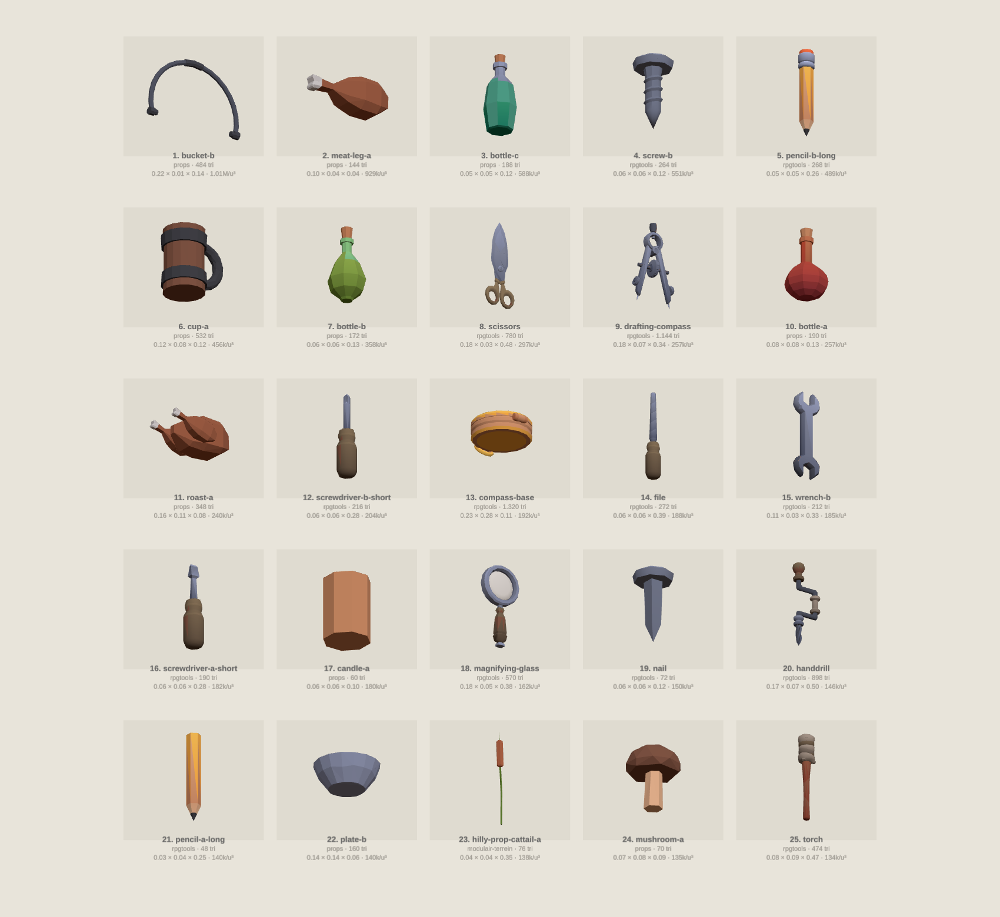
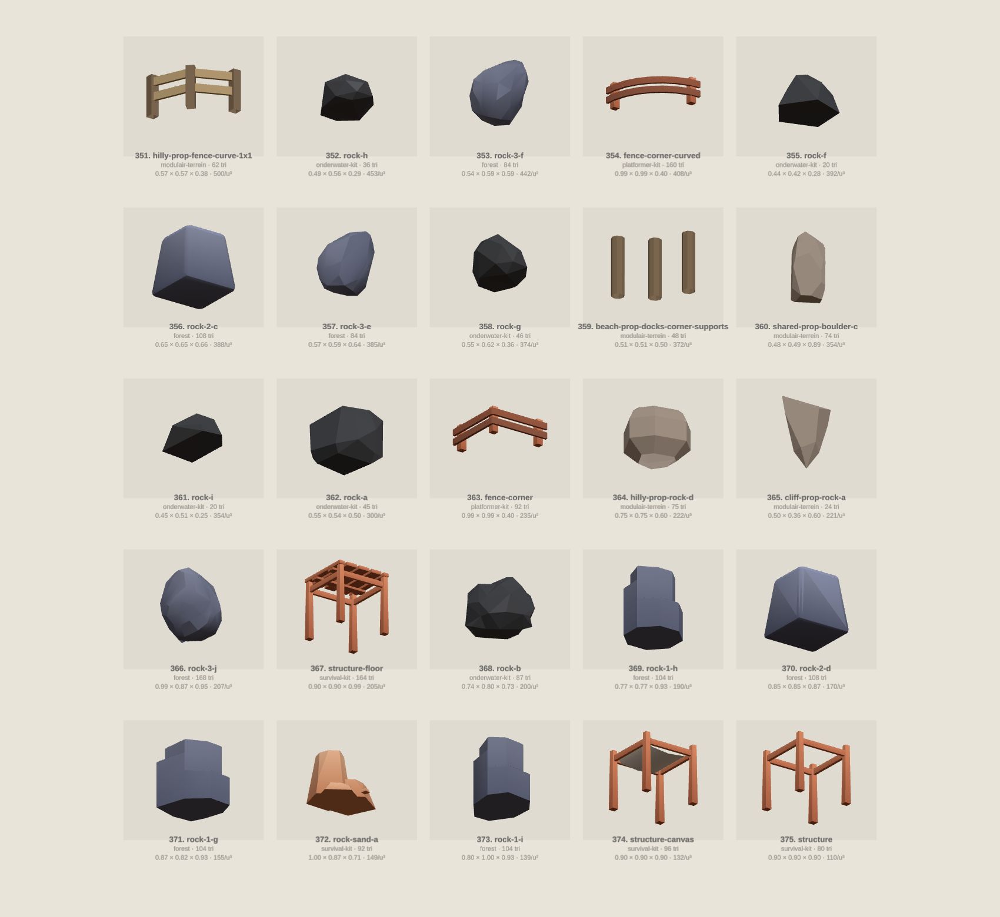

# Density against actual size

The catalog's `driehoekenPerUnit` measures triangles against a *budget cell*:
`max(1, w*d) * max(1, h)` (tools/glb.mjs). The clamp is deliberate — a bucket
smaller than one cell gets no discount for being small — but it means every
model that fits inside 1×1×1 divides by exactly 1, so for those the metric is
just the raw triangle count and says nothing about how densely the mesh sits in
the space it actually occupies.

This review re-ranks the small props on **triangles per cubic unit of their real
bounding box** (`driehoeken / (w*d*h)`, unclamped) to see where geometry is
spent on volume nobody sees.

Pool: **375 models** — every model with all three `wdh` under 1.0,
excluding the `terrein`, `bouwpakket`, `zee*` and `grot*` groups (terrain,
building kit, seabed and cave work, where "prop" does not apply). Median
density: **6,997 tri/u³**.

Regenerate the sheets with:

```
NODE_PATH=$(npm root -g) node tools/dichtheid/render.mjs
```

## Top 25 — densest



| # | model | kit | tri | volume (u³) | tri/u³ | w × d × h |
|---:|---|---|---:|---:|---:|---|
| 1 | `bucket-b` | props | 484 | 0.0005 | 1,006,917 | 0.22 × 0.01 × 0.14 |
| 2 | `meat-leg-a` | props | 144 | 0.0002 | 928,793 | 0.10 × 0.04 × 0.04 |
| 3 | `bottle-c` | props | 188 | 0.0003 | 587,641 | 0.05 × 0.05 × 0.12 |
| 4 | `screw-b` | rpgtools | 264 | 0.0005 | 550,881 | 0.06 × 0.06 × 0.12 |
| 5 | `pencil-b-long` | rpgtools | 268 | 0.0005 | 489,012 | 0.05 × 0.05 × 0.26 |
| 6 | `cup-a` | props | 532 | 0.0012 | 456,231 | 0.12 × 0.08 × 0.12 |
| 7 | `bottle-b` | props | 172 | 0.0005 | 357,960 | 0.06 × 0.06 × 0.12 |
| 8 | `scissors` | rpgtools | 780 | 0.0026 | 297,000 | 0.18 × 0.03 × 0.48 |
| 9 | `drafting-compass` | rpgtools | 1,144 | 0.0044 | 257,449 | 0.18 × 0.07 × 0.34 |
| 10 | `bottle-a` | props | 190 | 0.0007 | 256,990 | 0.08 × 0.08 × 0.13 |
| 11 | `roast-a` | props | 348 | 0.0014 | 240,424 | 0.16 × 0.11 × 0.08 |
| 12 | `screwdriver-b-short` | rpgtools | 216 | 0.0011 | 203,680 | 0.06 × 0.06 × 0.28 |
| 13 | `compass-base` | rpgtools | 1,320 | 0.0069 | 192,246 | 0.23 × 0.28 × 0.11 |
| 14 | `file` | rpgtools | 272 | 0.0014 | 188,399 | 0.06 × 0.06 × 0.39 |
| 15 | `wrench-b` | rpgtools | 212 | 0.0011 | 184,775 | 0.11 × 0.03 × 0.33 |
| 16 | `screwdriver-a-short` | rpgtools | 190 | 0.0010 | 181,714 | 0.06 × 0.06 × 0.28 |
| 17 | `candle-a` | props | 60 | 0.0003 | 180,161 | 0.06 × 0.06 × 0.10 |
| 18 | `magnifying-glass` | rpgtools | 570 | 0.0035 | 162,162 | 0.18 × 0.05 × 0.38 |
| 19 | `nail` | rpgtools | 72 | 0.0005 | 150,240 | 0.06 × 0.06 × 0.12 |
| 20 | `handdrill` | rpgtools | 898 | 0.0061 | 146,320 | 0.17 × 0.07 × 0.50 |
| 21 | `pencil-a-long` | rpgtools | 48 | 0.0003 | 140,056 | 0.03 × 0.04 × 0.25 |
| 22 | `plate-b` | props | 160 | 0.0011 | 139,720 | 0.14 × 0.14 × 0.06 |
| 23 | `hilly-prop-cattail-a` | modulair-terrein | 76 | 0.0005 | 138,188 | 0.04 × 0.04 × 0.35 |
| 24 | `mushroom-a` | props | 70 | 0.0005 | 135,362 | 0.07 × 0.08 × 0.09 |
| 25 | `torch` | rpgtools | 474 | 0.0035 | 134,258 | 0.08 × 0.09 × 0.47 |

## Bottom 25 — sparsest



| # | model | kit | tri | volume (u³) | tri/u³ | w × d × h |
|---:|---|---|---:|---:|---:|---|
| 351 | `hilly-prop-fence-curve-1x1` | modulair-terrein | 62 | 0.1240 | 500 | 0.57 × 0.57 × 0.38 |
| 352 | `rock-h` | onderwater-kit | 36 | 0.0795 | 453 | 0.49 × 0.56 × 0.29 |
| 353 | `rock-3-f` | forest | 84 | 0.1900 | 442 | 0.54 × 0.59 × 0.59 |
| 354 | `fence-corner-curved` | platformer-kit | 160 | 0.3920 | 408 | 0.99 × 0.99 × 0.40 |
| 355 | `rock-f` | onderwater-kit | 20 | 0.0510 | 392 | 0.44 × 0.42 × 0.28 |
| 356 | `rock-2-c` | forest | 108 | 0.2784 | 388 | 0.65 × 0.65 × 0.66 |
| 357 | `rock-3-e` | forest | 84 | 0.2181 | 385 | 0.57 × 0.59 × 0.64 |
| 358 | `rock-g` | onderwater-kit | 46 | 0.1229 | 374 | 0.55 × 0.62 × 0.36 |
| 359 | `beach-prop-docks-corner-supports` | modulair-terrein | 48 | 0.1290 | 372 | 0.51 × 0.51 × 0.50 |
| 360 | `shared-prop-boulder-c` | modulair-terrein | 74 | 0.2091 | 354 | 0.48 × 0.49 × 0.89 |
| 361 | `rock-i` | onderwater-kit | 20 | 0.0565 | 354 | 0.45 × 0.51 × 0.25 |
| 362 | `rock-a` | onderwater-kit | 45 | 0.1502 | 300 | 0.55 × 0.54 × 0.50 |
| 363 | `fence-corner` | platformer-kit | 92 | 0.3920 | 235 | 0.99 × 0.99 × 0.40 |
| 364 | `hilly-prop-rock-d` | modulair-terrein | 75 | 0.3375 | 222 | 0.75 × 0.75 × 0.60 |
| 365 | `cliff-prop-rock-a` | modulair-terrein | 24 | 0.1086 | 221 | 0.50 × 0.36 × 0.60 |
| 366 | `rock-3-j` | forest | 168 | 0.8113 | 207 | 0.99 × 0.87 × 0.95 |
| 367 | `structure-floor` | survival-kit | 164 | 0.8003 | 205 | 0.90 × 0.90 × 0.99 |
| 368 | `rock-b` | onderwater-kit | 87 | 0.4357 | 200 | 0.74 × 0.80 × 0.73 |
| 369 | `rock-1-h` | forest | 104 | 0.5480 | 190 | 0.77 × 0.77 × 0.93 |
| 370 | `rock-2-d` | forest | 108 | 0.6345 | 170 | 0.85 × 0.85 × 0.87 |
| 371 | `rock-1-g` | forest | 104 | 0.6727 | 155 | 0.87 × 0.82 × 0.93 |
| 372 | `rock-sand-a` | survival-kit | 92 | 0.6159 | 149 | 1.00 × 0.87 × 0.71 |
| 373 | `rock-1-i` | forest | 104 | 0.7493 | 139 | 0.80 × 1.00 × 0.93 |
| 374 | `structure-canvas` | survival-kit | 96 | 0.7290 | 132 | 0.90 × 0.90 × 0.90 |
| 375 | `structure` | survival-kit | 80 | 0.7290 | 110 | 0.90 × 0.90 × 0.90 |

## What drives the ranking: size first, curvature second

Small-and-round is the intuition the top-25 sheet invites, but the two factors
are separable and they are not equal.

**Size dominates.** Across the pool, log-density correlates −0.79 with log-volume
and only +0.27 with log-triangle-count. Triangle budget barely tracks size
(r = 0.39): the spread in log-volume (variance 3.4) is 2.4× the spread in
log-triangles (1.4). Artists spend a broadly similar triangle budget per object
regardless of how big it is, so dividing by real volume ranks the pool mostly by
smallness. Median volume is 0.001 u³ in the top 25 against 0.34 u³ in the bottom
25 — a factor of ~340 — while median triangle count differs by only 216 vs 84.

**Slenderness, not roundness, is the shape factor at the very top.** Median
aspect ratio (longest ÷ shortest dimension) is 4.6 in the top 25, 1.9 across the
pool, 1.2 in the bottom 25. Pencils, screws, nails, files and scissors rank high
because a sliver bounding box has almost no volume, not because they are round.

**Curvature does cost, but roughly 2.6×, not 100×.** Controlled for size in the
0.001–0.02 u³ band, median triangle counts are:

| shape family | n | median tri |
|---|---:|---:|
| round / lathe-turned (bottles, cups, candles, screws, nuggets) | 42 | 134 |
| blocky (boxes, crates, planks, bricks, signs) | 16 | 52 |
| rocks and boulders | 13 | 38 |

The rocks settle it: they are round too, and they sit at the *bottom* of the
ranking. A low-poly boulder is a faceted blob of 20–100 triangles spanning half
a unit. What makes a bottle expensive is not that it curves, but that it curves
around a lathe axis with enough segments to read as smooth at a fraction of the
size.

## Reading

The two ends are almost perfectly sorted by kit. `rpgtools` and `props` own the
top (24 of 25); `forest`, `onderwater-kit`, `modulair-terrein` and
`survival-kit` own the bottom (23 of 25). This is an authoring-density
difference per pack, not a per-object one: the handheld packs model pencils and
screws at the same triangle budget the rock packs spend on a whole boulder.

Two things the ranking surfaces that the per-unit metric hides:

- **`props/bucket-b` is a broken asset.** 484 triangles in a
  0.22 × 0.015 × 0.145 box — it is the *handle only*, with no pail (visible in
  the top-25 sheet). Its 1.0M tri/u³ is an artefact of a sliver bounding box.
  `props/bucket-a` (380 tri, 0.19³) is the intact bucket.
- **Sliver boxes inflate the metric generally.** Flat or wire-thin props
  (`scissors` 0.03 deep, `wrench-b` 0.03, `plate-b` 0.06 tall) rank high because
  volume collapses, not because the mesh is dense. Density against real volume
  is a lead, not a verdict — read it next to the triangle count.

The bottom end has no equivalent problem: those are genuinely coarse meshes.
`rock-f` (20 tri across 0.44 × 0.42 × 0.28) and `rock-i` (20 tri) are the
sparsest solids in the collection, and the survival-kit `structure` frames close
the list at 110 tri/u³.
