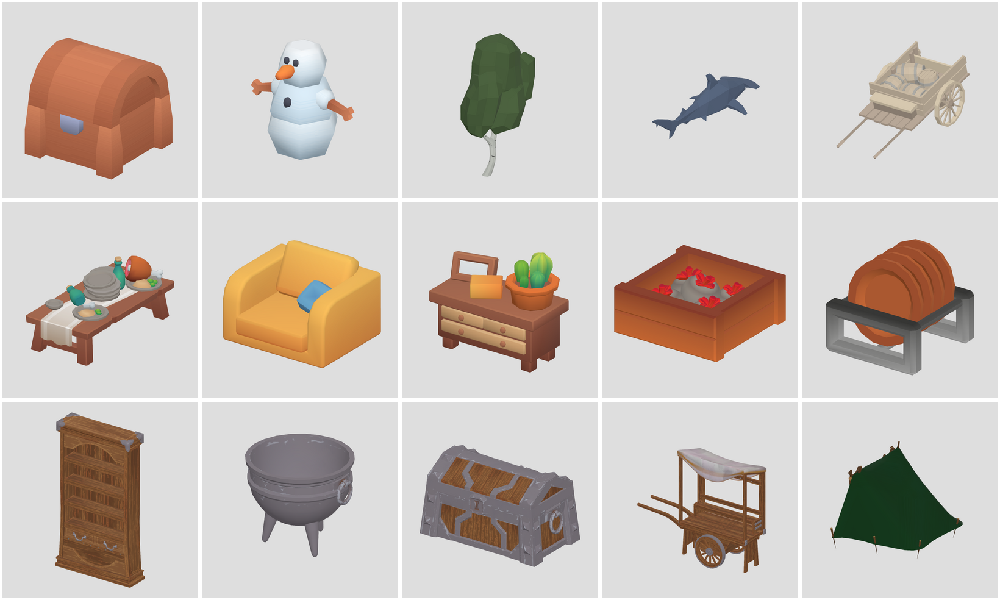
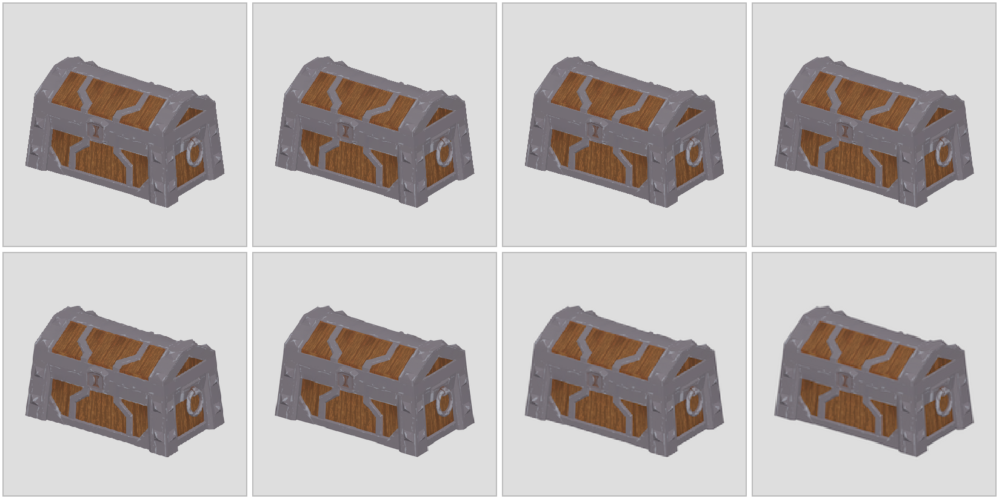
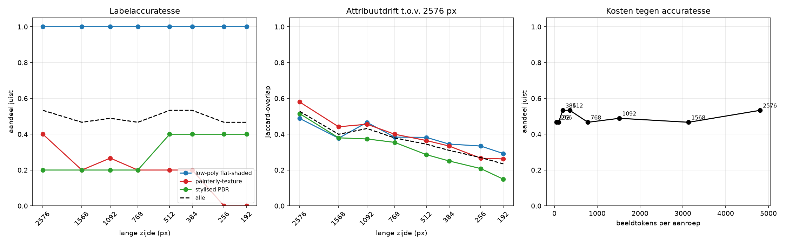
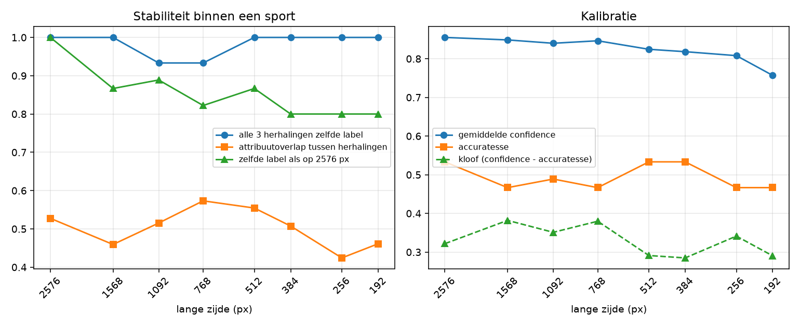

# Resolutie tegen stijloordeel

Meet hoe de lange zijde van een render het vermogen van het model beïnvloedt om
de visuele stijl van een 3D-asset te benoemen en te beschrijven. Eén
onafhankelijke variabele: resolutie. Al het andere ligt vast.

## Opzet

| onderdeel | keuze |
| --- | --- |
| stimuli | 15 assets, 3 stijlgroepen van 5, uit de kits in `kits/missing/` |
| bron | PNG, 2576×2576, orthografisch driekwartsaanzicht |
| ladder | 2576, 1568, 1092, 768, 512, 384, 256, 192 px |
| herhalingen | 3 per (asset × sport), volgorde geschud uit seed 20260829 |
| prompt | `tools/resolutie-stijl/prompt.txt`, beeldblok vóór tekst |
| model | via de Claude Agent SDK, extended thinking uit |

De resolutie wordt nergens in de prompt genoemd.

### Stijlgroepen

De opzet vroeg om zes stijlassen. De kits in deze repo dekken er drie; voor
painterly-texture, hard-surface realistic en organic sculpt is hier geen
bronmateriaal. De drie ontbrekende labels blijven wel in de antwoordlijst staan
en werken zo als afleider: er is geen enkel juist antwoord dat ze gebruikt.

| groep | bron | wat het beeld toont |
| --- | --- | --- |
| low-poly flat-shaded | Kenney, Quaternius, Modular Village, ocean | vlakke kleurvlakken, zichtbare facetten, geen textuurdetail |
| stylised PBR | KayKit (Dungeon, Furniture, Restaurant) | gladde schaduwverlopen, verzadigde kleurblokken, geen korrel |
| painterly-texture | FantasyProps 1k, nature_kit | geschilderde houtnerf en stofweefsel, ingebakken schaduw in de textuur |

Elke groep valt grotendeels samen met één leverancier. Dat is de eerlijke
beperking van deze stimuli: stijl en herkomst zijn hier niet los te trekken.

Voor `stylised PBR` staat ook `toon-cel` als aanvaardbaar tweede label in de
grondwaarheid; de samenvatting rapporteert daarom naast de strikte accuratesse
ook een soepele. De strikte telt.

De grondwaarheid — label plus vijf attribuuttags per asset — staat in
`tools/resolutie-stijl/stimuli.json` en is met de hand geschreven op basis van
de 2576px renders, vóór de eerste modelaanroep.

## Draaien

```sh
npm install -g @anthropic-ai/claude-agent-sdk   # eenmalig, naast three en playwright
node tools/resolutie-stijl/render.mjs           # 15 bronrenders op 2576 px
node tools/resolutie-stijl/ladder.mjs           # één Lanczos-pass per sport
NODE_PATH=$(npm root -g) node tools/resolutie-stijl/run.mjs --model=claude-opus-5
python3 tools/resolutie-stijl/score.py
```

`run.mjs` schrijft één JSON-regel per aanroep naar
`docs/resolutie-stijl/runs/<model>.jsonl` en slaat bij herstart over wat al
gelogd is. `score.py` maakt `resultaten/aanroepen.csv`,
`resultaten/samenvatting.csv` en twee figuren.

## Maten

1. **Accuratesse** — aandeel juiste labels per sport, tegen de handlabels.
2. **Drift** — Jaccard-overlap van de attribuutwoorden met de antwoorden van
   hetzelfde asset op 2576 px, gemiddeld over alle 3×3 paren.
3. **Herhaalspreiding** — binnen één sport: hoe vaak alle drie de herhalingen
   hetzelfde label geven, en hoeveel attribuutoverlap ze onderling hebben.
4. **Kalibratie** — gemiddelde `confidence` tegen werkelijke accuratesse. Een
   confidence die vlak blijft terwijl de accuratesse zakt, is het gevaarlijke
   geval.
5. **Tokens** — beeldtokens per aanroep tegen accuratesse. De ijkaanroep (een
   1×1 beeld met dezelfde prompt) geeft de vaste overhead van de SDK; het
   verschil is wat het beeld zelf kost.

## Wat er niet vastligt

- De Agent SDK stelt geen temperature beschikbaar. De drie herhalingen meten
  daarom de spreiding die het model uit zichzelf heeft; dat is precies wat maat
  3 wil weten, maar het is geen temperature 0.
- De vaste promptoverhead van de SDK (~25k tokens) staat los van het beeld en
  is in de tokenmaat afgetrokken.





## Uitkomst

360 aanroepen op `claude-opus-5`, geen mislukte. Ruwe data:
`runs/claude-opus-5.jsonl`, `resultaten/aanroepen.csv`,
`resultaten/samenvatting.csv`.





| px | accuratesse | drift | label = 2576 | polycount = 2576 | confidence | kloof | beeldtokens |
| ---: | ---: | ---: | ---: | ---: | ---: | ---: | ---: |
| 2576 | 0.53 | 0.53 | 1.00 | 1.00 | 0.86 | +0.32 | 4805 |
| 1568 | 0.47 | 0.40 | 0.87 | 0.93 | 0.85 | +0.38 | 3135 |
| 1092 | 0.49 | 0.43 | 0.89 | 0.91 | 0.84 | +0.35 | 1520 |
| 768 | 0.47 | 0.38 | 0.82 | 0.93 | 0.85 | +0.38 | 783 |
| 512 | 0.53 | 0.34 | 0.87 | 0.93 | 0.82 | +0.29 | 360 |
| 384 | 0.53 | 0.31 | 0.80 | 0.87 | 0.82 | +0.28 | 195 |
| 256 | 0.47 | 0.27 | 0.80 | 0.84 | 0.81 | +0.34 | 99 |
| 192 | 0.47 | 0.23 | 0.80 | 0.78 | 0.76 | +0.29 | 48 |

De drift op 2576 px (0.53) is de overlap van de herhalingen onderling: dat is
het plafond, niet 1.0. Vrije tekst herhaalt zichzelf nooit woordelijk.

### De stijlgroepen lopen uiteen, zoals verwacht

| groep | 2576 | 1568 | 1092 | 768 | 512 | 384 | 256 | 192 |
| --- | ---: | ---: | ---: | ---: | ---: | ---: | ---: | ---: |
| low-poly flat-shaded | 1.00 | 1.00 | 1.00 | 1.00 | 1.00 | 1.00 | 1.00 | 1.00 |
| painterly-texture | 0.40 | 0.20 | 0.27 | 0.20 | 0.20 | 0.20 | 0.00 | 0.00 |
| stylised PBR | 0.20 | 0.20 | 0.20 | 0.20 | 0.40 | 0.40 | 0.40 | 0.40 |

Silhouetaanwijzingen houden stand tot onderaan de ladder: de flat-shaded groep
blijft op 192 px foutloos en verandert daar ook nooit van label. De
textuuraanwijzingen zakken weg: painterly-texture haalt op 2576 px nog 0.40 en
op 256 en 192 px niets meer, en van de vijf painterly-assets houdt maar 60% op
192 px het label vast dat het op 2576 px kreeg. Dat is precies de voorspelde
scheiding — alleen ligt het hele niveau lager dan gehoopt, en dat komt niet
door de resolutie.

### De grootste foutbron is de indeling zelf, niet de resolutie

265 van de 360 antwoorden zijn `low-poly flat-shaded`. Het model behandelt deze
kits als één familie: van de assets die met de hand als `stylised PBR` of
`painterly-texture` zijn gelabeld, valt het merendeel op elke sport in de
flat-shaded bak. Dat gebeurt net zo goed op 2576 px als op 192 px, dus het is
geen resolutie-effect maar een grensgeschil over de taxonomie. De stimuli zijn
alle vijftien game-props uit hobbykits; de zesdelige stijllijst uit de opzet
veronderstelt een bredere spreiding dan dit materiaal biedt.

Daarom staat `label = 2576` in de tabel: dat vergelijkt elk antwoord met het
antwoord van hetzelfde asset op de topsport in plaats van met de handlabels, en
meet dus wél zuiver wat resolutie doet. Die zakt van 1.00 naar 0.80.

### Herhaalspreiding waarschuwt hier niet

De opzet verwachtte dat de instabiliteit oploopt vóórdat de accuratesse zakt.
Dat gebeurt niet: op zes van de acht sporten geven alle drie de herhalingen
hetzelfde label, ook op 192 px. Met extended thinking uit is het model bijna
deterministisch, en de spreiding tussen herhalingen zegt daardoor niets over de
resolutie. Wat wél monotoon meebeweegt is de attribuutdrift (0.53 → 0.23) en de
polycount-indruk (1.00 → 0.78): de vrije beschrijving verandert veel eerder en
gelijkmatiger dan het label.

### Confidence volgt de resolutie nauwelijks

De confidence zakt van 0.86 naar 0.76 terwijl de accuratesse vlak blijft; de
kloof blijft de hele ladder rond +0.30. Tussen de groepen zégt de confidence
wel iets — 0.93 op de groep die altijd goed is, 0.75 op de groep die meestal
fout is — maar binnen een asset daalt hij niet met het beeld mee. Wie op de
confidence afgaat om te bepalen of een render groot genoeg was, krijgt geen
signaal.

### Kosten

Van 2576 naar 512 px kost 13× minder beeldtokens (4805 → 360) zonder verlies op
label-accuratesse of labelvastheid; onder 384 px begint de labelvastheid en de
polycount-indruk te schuiven. De knik ligt dus rond 512 px voor een label, maar
wie de beschrijving zelf gebruikt — `attributes`, `surface_finish` — betaalt
daar al fors: de drift is op 512 px nog maar 0.34 tegen een plafond van 0.53.
Voor stijl*beschrijving* is 1568 px de laagste sport die de bovenkant benadert.
De latency loopt nauwelijks mee (6.7 s op 2576 px, 5.8 s op 192 px).

### Beperkingen

- Elke stijlgroep valt grotendeels samen met één leverancier; stijl en herkomst
  zijn niet los te trekken.
- De handlabels splitsen een familie die het model als één geheel ziet. Een
  volgende ronde heeft stimuli nodig die de zes assen echt beslaan, of een
  taxonomie die bij dit materiaal past.
- Eén camerastandpunt per asset. Een tweede standpunt zou laten zien hoeveel
  van de flat-shaded zekerheid aan het silhouet hangt.
- Geen temperature-instelling beschikbaar via de Agent SDK; extended thinking
  stond uit.
